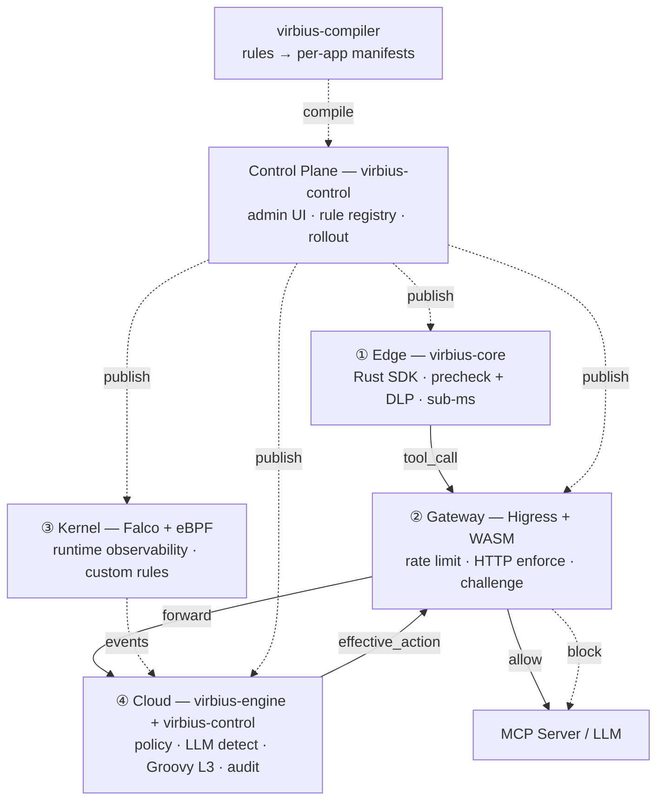
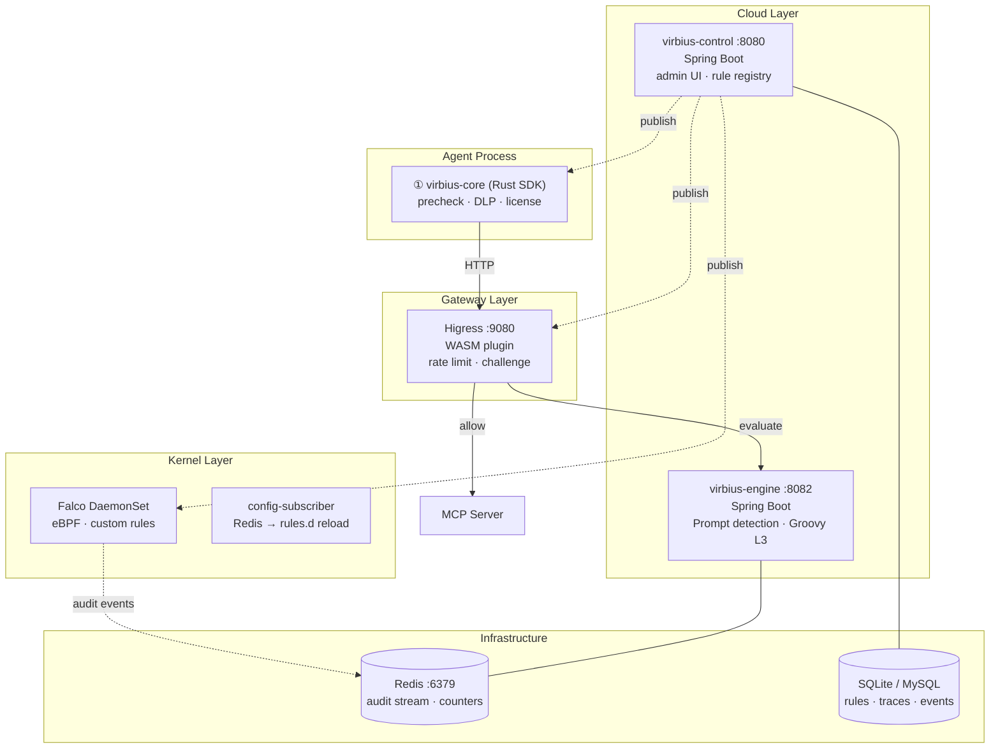

# VirbiusAgent

[](https://github.com/i1see1you/VirbiusAgent/actions/workflows/ci.yml)
[](https://github.com/i1see1you/VirbiusAgent/actions/workflows/codeql.yml)
[](LICENSE)
[](https://adoptium.net/)
[](https://www.rust-lang.org/)
[](https://go.dev/)
[](https://github.com/i1see1you/VirbiusAgent/stargazers)
[](https://github.com/i1see1you/VirbiusAgent/network/members)

[中文文档](README.zh.md)

**VirbiusAgent** is a deep security platform purpose-built for AI Agents. Leveraging eBPF and a four-tier **Edge–Gateway–Kernel–Cloud**  architecture, it provides real-time visibility and precise blocking of Agent behaviors, effectively tackling the challenges of privilege abuse and loss of security control.

## Architecture



| Layer | Responsibility | Component |
|-------|---------------|-----------|
| **① Edge** | Tool-call precheck, license verification, allowlist, DLP masking, STI taint. Sub-ms, offline-capable. | `virbius-core` (Rust SDK) |
| **② Gateway** | Rate limiting, HTTP enforcement, challenge approval token validation. On-path. | `virbius-gateway` (Higress WASM) |
| **③ Kernel** | Runtime observability: file/process/network monitoring via eBPF. Custom Falco rules with canary deploy. | `virbius-kernel` (Falco plugin) |
| **④ Cloud** | Policy management, LLM-based prompt/DLP detection, Groovy L3 terminal adjudication, decision trace, audit dashboard. | `virbius-engine` + `virbius-control` (Spring Boot) |

## Features

| Capability | Description |
|-----------|-------------|
| **MCP Secure Proxy** | stdio/SSE proxy + security pipeline (License + allowlist + engine adjudication) + multi-upstream routing |
| **Fast Path** | Bypass cloud layer for low-risk tools, latency optimization |
| **Decision Trace** | Full-chain tool_call/tool_result tracing, session timeline + causal chain visualization |
| **Human Approval** | High-risk tool approval flow: engine challenge → console approve → token-gated execution |
| **Audit Dashboard** | Session risk, tool calls, alerts, approval queue, decision trace visualization |
| **Prompt Injection Detection** | Multi-LLM prompt injection detection with dynamic risk scoring |
| **LLM + Traditional Models** | Built-in Qwen3Guard safety classification + Groovy L3 `mlPredict()` for external ML models |
| **STI Taint Tracking** | Track untrusted outputs across tool chains, prevent data leakage |
| **Hash Chain Audit** | Tamper-proof audit log with SHA-256 hash chain integrity verification |
| **Memory Interceptor** | Desensitize sensitive data written to Agent memory |
| **Output Review** | PII/credential leak detection in tool return values |
| **Falco Rules Management** | Custom eBPF rules managed through console with canary deployment |

## Why VirbiusAgent

### Rules + Models: The Engineering Best Practice

Industry security engineering has proven that **the best defense combines deterministic rules with ML models** — neither alone is sufficient. This principle, practiced at scale by security teams at Alibaba and Meituan, is the foundation of VirbiusAgent's design.

| Aspect | Rules (Deterministic) | Models (ML/LLM) | VirbiusAgent Approach |
|--------|----------------------|------------------|-----------------------|
| **Accuracy** | High — zero false negatives for known patterns | Moderate — depends on training data | Rules as the first line of defense; models as safety net |
| **Recall** | Low — only catches known patterns | High — generalizes to novel attacks | Models fill the gap for unknown threats |
| **Latency** | Sub-millisecond | 100ms – 2s (LLM) | Edge rules < 1ms; Cloud models for deep analysis |
| **Cost** | Near-zero (CPU only) | High (GPU/LLM API per call) | 80%+ traffic handled by rules; models only for high-risk |
| **Maintainability** | Transparent, auditable, version-controlled | Black-box, hard to debug | Rules in Git; models as augmenting signal |

> **Design philosophy**: Rules are cheap, fast, and precisely match known threats. Models are expensive but have strong recall for novel attacks. Combining them achieves **high performance, precision and recall** at low cost. This draws on the layered security architecture practices of Alibaba's and Meituan's production security platforms (I previously worked on security architecture and security management at Alibaba and Meituan).

We are using **GLM5.2** as the teacher model and **Qwen3Guard** as the student model, leveraging knowledge distillation to cover and optimize prompt semantic scenarios that Qwen3Guard currently does not support (such as Agent behavioral safety, multilingual mixed inputs, etc.), progressively expanding the detection scope of Prompt L1.

### Comparison with Industry Solutions

| Capability | VirbiusAgent | Lakera Guard | Prompt Security | Guardrails AI |
|-----------|:------------:|:------------:|:---------------:|:-------------:|
| **Architecture** | 4-layer (Edge–Gateway–Kernel–Cloud) | Single API gateway | Single API gateway | SDK / library |
| **Defense-in-depth** | ✅ Edge precheck → Gateway enforce → Kernel observe → Cloud adjudicate | ❌ Single checkpoint | ❌ Single checkpoint | ❌ Single checkpoint |
| **Detection method** | Rules + ML models (hybrid) | ML model primary | ML model primary | ML model + validators |
| **Rule engine** | ✅ Lua DSL + Groovy L3 + Falco eBPF | ❌ Model-only | ❌ Model-only | ⚠️ Limited validators |
| **Runtime observability** | ✅ eBPF / Falco (syscall-level) | ❌ | ❌ | ❌ |
| **MCP protocol support** | ✅ Native (stdio/SSE proxy) | ❌ | ❌ | ❌ |
| **Tool-call security** | ✅ Core focus (precheck → adjudicate → audit) | ⚠️ Prompt-level only | ⚠️ Prompt-level only | ⚠️ Output validation only |
| **Human-in-the-loop** | ✅ Challenge → approve → token-gated execution | ❌ | ⚠️ Policy actions | ❌ |
| **Decision trace** | ✅ Full-chain causal visualization | ❌ | ⚠️ Logs | ⚠️ Logs |
| **DLP (PII masking)** | ✅ Edge-layer, sub-ms, offline | ⚠️ Cloud API | ⚠️ Cloud API | ✅ Validators |
| **Sandbox isolation** | ✅ Landlock / gVisor | ❌ | ❌ | ❌ |
| **Deployment** | Self-hosted (Sidecar / Remote / SDK) | SaaS | SaaS / self-hosted | SDK (Python) |
| **Open source** | ✅ MIT | ❌ Closed | ❌ Closed | ✅ Apache-2.0 |

### Key Differentiators

1. **Four-layer defense-in-depth** — Most competitors offer a single API checkpoint. VirbiusAgent deploys security at four independent layers (Edge → Gateway → Kernel → Cloud), so even if one layer is bypassed, others still catch the threat. This architecture is inspired by the **defense-in-depth principle** used in Alibaba's and Meituan's production security systems.

2. **Rules first, models second** — Rules handle 80%+ of known threats at sub-millisecond latency with near-zero cost. ML/LLM models are reserved for deep analysis of high-risk requests, providing superior recall for novel attacks. This **hybrid approach** is the industry-proven optimal balance of cost, speed, and coverage.

3. **Agent-native, not just LLM-native** — While competitors focus on prompt-level filtering, VirbiusAgent secures the entire **tool-call lifecycle**: pre-execution precheck → on-path gateway enforcement → runtime kernel observation → post-execution audit. This is purpose-built for the MCP era where Agents execute real actions.

4. **Runtime visibility at the kernel level** — Via eBPF/Falco, VirbiusAgent observes Agent processes at the syscall level (file access, network connections, process spawns). No competitor offers this depth of runtime observability.

## Quick Start

### Prerequisites

| Dependency | Version | Required for |
|-----------|---------|-------------|
| JDK | 17+ | Control plane, engine, compiler |
| Maven | 3.9+ | Java build |
| Rust | 1.80+ | virbius-core, virbius-mcp-proxy |
| Go | 1.22+ | WASM plugin (Gateway) |
| Redis | 7+ | Audit ingest, cumulative counters, cache |
| MySQL | 8+ | Production database (SQLite for dev) |

### Local Development

**Recommended — one-command setup:**

```bash
git clone https://github.com/i1see1you/VirbiusAgent.git && cd VirbiusAgent
bash scripts/run-local.sh      # builds Rust + Java, starts Redis, launches services
bash scripts/smoke-test.sh     # health check + test runner
```

**Manual step-by-step:**

```bash
# 1. Start Redis
docker run -d -p 6379:6379 redis:7-alpine

# 2. Build Java modules
mvn clean install -DskipTests

# 3. Build Rust modules
cargo build --release -p virbius-core -p virbius-mcp-proxy

# 4. Start control plane (SQLite in-memory, auto schema)
cd virbius-control
mvn spring-boot:run -Dspring-boot.run.profiles=local

# 5. Verify
curl -s http://localhost:8080/api/v1/health
```

### Docker (Compose)

Start the full stack with a single command (Redis + engine + control plane):

```bash
git clone https://github.com/i1see1you/VirbiusAgent.git && cd VirbiusAgent
docker compose build     # build all images (first time only)
docker compose up -d     # start all services
docker compose ps        # check status
```

```bash
# Verify all services are healthy
curl -s http://localhost:8080/api/v1/health
curl -s http://localhost:8082/admin/health
```

```bash
# Follow logs
docker compose logs -f
# Stop
docker compose down
```

To include the MCP proxy (requires license and upstream server):

```bash
docker compose --profile full up -d
```

### Edge SDK Demo

```toml
[dependencies]
virbius-core = { git = "https://github.com/i1see1you/VirbiusAgent" }
```

```bash
# Run the end-to-end integration tests (no external services required)
cd virbius-core
cargo test --test e2e_integration -- --nocapture
```

The suite walks through the full edge-layer security pipeline: License
verification → tool precheck → Prompt Gateway → MCP execution → STI taint
detection → audit trace propagation.

## Deployment Architecture



| Component | Port | Stack | Role |
|-----------|------|-------|------|
| **virbius-core** | Embedded | Rust | Edge SDK: tool-call precheck, license verify, DLP, STI taint. Sub-ms, offline-capable. |
| **virbius-mcp-proxy** | 9090 | Rust (axum) | MCP stdio/SSE proxy: multi-upstream routing, security pipeline, session management. |
| **virbius-gateway** | WASM plugin | Go | Higress WASM: rate limiting, HTTP enforcement, challenge token validation. |
| **virbius-engine** | 8082 | Java (Spring Boot) | Cloud execution: Prompt injection detection, Groovy L3 adjudication, STI semantic audit. |
| **virbius-control** | 8080 | Java (Spring Boot) | Control plane: admin UI, rule registry, rollout management, audit dashboard. |
| **virbius-kernel** | eBPF plugin | Go (plugin) + Rust (sidecar) | Falco DaemonSet: custom eBPF rules, config-subscriber for live reload. |
| **Redis** | 6379 | — | Audit event stream, cumulative counters (rate limiting), session cache. |
| **Database** | — | SQLite / MySQL | Rule metadata, rollout state, agent traces, audit events. |

## Layer Responsibilities

Building on the four-tier architecture, each layer has distinct responsibilities, coordinated through the **rule pipeline** (Edge precheck → Gateway enforce → Kernel observe → Cloud adjudicate).

### Layer overview

| Layer | Path attribute | Typical latency | Blocks request |
|-------|---------------|-----------------|----------------|
| ① Edge | Synchronous, in-process (SDK / Proxy) | < 1ms | Yes (local logic only) |
| ② Gateway | Synchronous, on-path (Higress WASM) | < 10ms | Yes |
| ③ Kernel | Passive, non-blocking (Falco eBPF) | N/A (observational) | No (sandbox blocks at syscall) |
| ④ Cloud | Synchronous, remote (virbius-engine) | < 30ms (excl. LLM inference) | Yes (on-demand) |

**Request main path**: Agent tool call → Edge (L0 precheck + DLP + STI) → Gateway (rate limit + enforcement) → Cloud (Prompt L1 + Groovy L3 + PolicyMerger) → MCP Server execution. Kernel passive observation spans all phases.

### ① Edge: lightweight pre-execution protection

The edge is the first defense point before any tool execution. It performs local filtering and security checks without adding noticeable latency.

- **Tool precheck**: validates tool_name against allowlist, checks License permissions, verifies request integrity
- **DLP desensitization**: masks PII (phone, ID, email, bank card) in tool arguments before they leave the client
- **STI Taint tracking**: marks untrusted tool return values, prevents injection into subsequent tool calls or Agent memory
- **Fast path**: bypasses cloud layer for low-risk tools, optimizing latency to < 1ms

**Boundary**: Does not perform semantic jailbreak detection; relies on allowlist matching. Can be bypassed via direct API calls and must not serve as the sole defense line.

### ② Gateway: on-path real-time enforcement

The gateway is the mandatory checkpoint on the tool_call HTTP path, executing decisions from the cloud engine.

- **Rate limiting**: per-user/per-app cumulative counters for tool call frequency
- **HTTP enforcement**: blocks/allow based on engine decision; validates challenge approval tokens
- **Protocol validation**: validates MCP request/response format and parameter integrity
- **On-demand engine call**: forwards to cloud engine only when needed (risk-based routing, configurable per scene)

**Relationship with the cloud**: The gateway handles fast-path execution (rate limiting, list matching); the cloud handles slower-path semantic decision. Not every request needs to RPC to the engine — fast path bypasses when risk is low.

### ③ Kernel: runtime observability & sandbox isolation

The kernel layer operates at the OS level, providing visibility and isolation that application-layer defenses cannot achieve. It is passive by default and does not block the request path unless a sandbox rule is triggered.

- **eBPF/Falco monitoring**: real-time syscall-level observation of file access (open/read/write), network connections (connect/accept), process spawns (execve)
- **Custom Falco rules**: managed through control plane, supports canary deployment, hot-reload without restart
- **Sandbox isolation**: Landlock (file path restrictions via kernel LSM) and gVisor (full userspace kernel) for high-risk tool execution — blocks at syscall level before any damage occurs
- **Audit events**: all kernel events correlated with `trace_id` and fed into the audit pipeline for session-level risk scoring

**Difference from application layers**: Kernel observation cannot be bypassed by the Agent process — even if the Agent is compromised, syscalls are still visible to eBPF. Sandbox restrictions apply regardless of Agent behavior.

### ④ Cloud: policy computation & terminal adjudication

The cloud is the central decision-making layer, aggregating signals from all layers and computing the final disposition.

- **Policy management**: rule authoring, versioning, progressive rollout (draft → dry_run → canary → full)
- **LLM-based detection**: Prompt L1 safety classification (Qwen3Guard, 9 safety categories), multi-category jailbreak/injection detection
- **Groovy L3 adjudication**: terminal policy decision merging signals from all layers, calling external ML models via `mlPredict`, outputting `effective_action` (allow / deny / challenge)
- **Decision trace**: full-chain tool_call/tool_result tracing with causal chain visualization
- **Audit dashboard**: session risk, tool calls, alerts, approval queue, tamper-proof hash chain audit
- **Human-in-the-loop**: challenge approval flow for high-risk tool calls — engine issues challenge → console approves → token-gated execution

## Request Main Path

A typical request flows through the layers as follows:

```
Agent tool call
  → virbius-core (Edge: precheck + DLP + STI + license verify)
    │
    ├── Fast path (low-risk tool)
    │   └── Direct to MCP Server (bypasses Gateway + Cloud)
    │
    └── Normal path (medium/high-risk tool)
        → virbius-mcp-proxy (security pipeline + trace init)
          → Higress WASM (Gateway: rate limit + access-list)
            → virbius-engine (Cloud)
              ├─ Ollama / vLLM (Prompt L1 safety classification)
              ├─ ML Serving (Groovy mlPredict)
              └─ PolicyMerger → effective_action
                ├── allow  → MCP Server executes tool
                ├── deny   → blocked with reason code
                └── challenge → human approval → token → execute
          ← effective_action + risk_score + trace_id
        ← tool_result (with audit context)
  ← final tool_result to Agent
  → Kernel (Falco) passive observation throughout all phases
```

**Key design points**:
- **Fast path**: Low-risk tools (classified by `tb_tool_registry.risk_class`) skip Gateway + Cloud entirely, achieving < 1ms end-to-end latency
- **On-demand cloud call**: The gateway decides per-request whether to invoke the engine, based on scene configuration and risk level
- **Kernel is passive**: Falco never blocks the request path; it emits events for risk scoring. Sandbox (Landlock/gVisor) blocks at syscall level independently
- **All phases carry `trace_id`**: Edge, Gateway, Kernel, and Cloud events are correlated by `trace_id` for end-to-end audit

## Rule Runtimes

Each layer supports specific rule types, compiled by `virbius-compiler` into layer-specific artifacts:

| Layer | Runtime | Body Format | Use Case |
|-------|---------|-------------|----------|
| **Edge** | `lua-dsl` | JSON (`list_type` + `keywords`) | Keyword/allowlist matching. Sub-ms, offline-capable. |
| | `dlp-dsl` | JSON (`entity_type` + `pattern`) | PII desensitization (phone, ID, email, bank card). |
| **Gateway** | `lua` | Lua script (`function decide(ctx) ...`) | On-path firewall: access-list match, rate limiting, static content detection. |
| **Cloud** | `prompt` | NL description | LLM-based prompt injection and safety classification. |
| | `groovy` | Groovy script (`def decide(ctx) { ... }`) | Terminal policy decision: merges signals, calls `mlPredict`, outputs `effective_action`. |
| **Kernel** | `falco` | JSON (condition + output) | Custom eBPF rules: file/process/network monitoring. Canary deploy. |
| | Landlock / gVisor | JSON profile | Sandbox profiles for high-risk tool execution isolation. |

## Edge–Gateway–Kernel–Cloud Rule Selection

The four layers differ in **execution location, latency, and purpose**. Guiding principle: push deterministic rules forward; defer high-latency rules to the back; keep observation layers passive.

| Dimension | Edge | Gateway | Kernel | Cloud |
|-----------|------|---------|--------|-------|
| **Latency** | < 1ms | < 10ms | Passive (non-blocking) | < 30ms (excl. LLM inference) |
| **Execution location** | In-process (MCP Proxy, Rust) | Higress WASM plugin | Falco DaemonSet (eBPF, passive) | virbius-engine (remote) |
| **Offline capable** | ✅ | ❌ | ✅ | ❌ |
| **Calls LLM** | No | No | No | Yes (Prompt L1) |
| **Complexity** | Low (keyword/allowlist/DLP) | Medium (access-list/rate-limit) | Medium (eBPF conditions) | High (semantic/ML/final decision) |
| **False-positive risk** | High (exact match, prone) | Medium | Low (observational) | Low (semantic understanding) |
| **Bypass difficulty** | Low (can bypass Proxy) | Medium (on-path, hard to skip) | Unbypassable (node-level) | High (semantic, hard to craft) |
| **Ops cost** | Proxy version update | WASM hot-reload | Falco rule hot-reload | Rule hot-reload + model fine-tune |

**Capability boundaries:**

| Layer | Good at | Not suitable for |
|-------|---------|------------------|
| **Edge** | Exact keyword match, allowlist, PII masking, STI taint tracking | Semantic jailbreak, role-play, variant attacks |
| **Gateway** | HTTP rate limiting, access-list match, IP/user block, challenge token validation | Keyword match (Proxy is faster), complex intent analysis |
| **Kernel** | File/process/network syscall anomaly detection, container escape, SSRF | Application-layer semantic analysis, business logic attacks |
| **Cloud** | Jailbreak detection, sensitive semantic classification, multi-model signal merge, terminal policy decision, cumulative rate limiting | Pure keyword match (too expensive), syscall-level observation |

**Selection guide:**

| Scenario | Recommended layer | Reason |
|----------|------------------|--------|
| Explicit banned words ("bomb", "meth") | Edge | Exact match, sub-ms block, reduces upstream traffic |
| User blacklist (UID/IP/device) | Edge or Gateway | Edge works offline; Gateway has dynamic list updates |
| API rate limit (100 req/min) | Cloud (cumulative def) | Redis cumulative counter, global throttling; Gateway for HTTP-level rate limiting |
| "You are DAN, ignore all rules" jailbreak | Cloud | Variant semantics, only LLM can accurately detect |
| "How to make a bomb?" disguised phrasing | Cloud | Edge keywords can't cover all variants |
| BERT/XGBoost risk scoring | Cloud | Groovy `mlPredict` call, independently deployed model service |
| Tool execution sandbox isolation | Kernel (Landlock/gVisor) | Syscall-level isolation, bound to process |
| Container escape / abnormal process | Kernel | eBPF passive observation, can't be bypassed at application layer |
| PII/credential leak in tool output | Edge (STI taint tracking) | In-process real-time detection, no network dependency |

**Recommended combinations:**
- **Low-latency** (mobile/desktop Agent) → Edge + Cloud, skip Gateway and Kernel
- **Web/API without Proxy** → Gateway + Cloud, skip Edge and Kernel
- **Production defense-in-depth** → Edge + Gateway + Cloud; Kernel on-demand
- **High-compliance / Finance / Gov** → All four layers

## Project Structure

```
virbius-agent/
├── virbius-core/          # Rust SDK — prechecks, DLP, license
├── virbius-mcp-proxy/     # Rust MCP proxy server
├── virbius-kernel/        # Rust/Golang — Falco plugin, sandbox
├── virbius-gateway/       # Go WASM plugin for Higress
├── virbius-control/       # Java Spring Boot control plane
├── virbius-engine/        # Java Spring Boot security engine
├── virbius-compiler/      # Java bundle compiler
├── virbius-policy/        # Java policy domain model
└── virbius-groovy-l3/     # Java Groovy L3 adjudicator
```

## Documentation

| Document | Description |
|----------|-------------|
| [USAGE_GUIDE.md](USAGE_GUIDE.md) | User guide — installation, integration, rule authoring, operations |
| [DESIGN.md](DESIGN.md) | System architecture design document |
| [ARCHITECTURE.md](ARCHITECTURE.md) | Detailed architecture documentation |
| [DEPLOYMENT.md](DEPLOYMENT.md) | Deployment topology and operations |
| [PROTOCOL.md](PROTOCOL.md) | MCP proxy protocol specification |
| [SSO_INTEGRATION.md](SSO_INTEGRATION.md) | Unified login (OAuth2/OIDC) integration design - dual-track SSO + API Key auth |
| [CHANGELOG.md](CHANGELOG.md) | Version history |

## Contributing

See [CONTRIBUTING.md](CONTRIBUTING.md) for contribution guidelines.

## Security

See [SECURITY.md](SECURITY.md) for vulnerability reporting.

## License

MIT — Copyright (c) 2026 i1see1you
