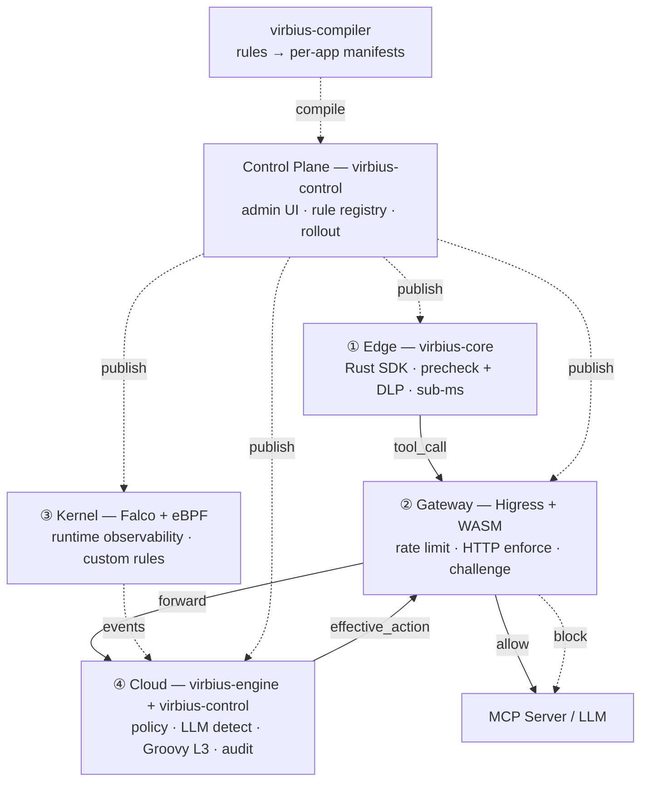
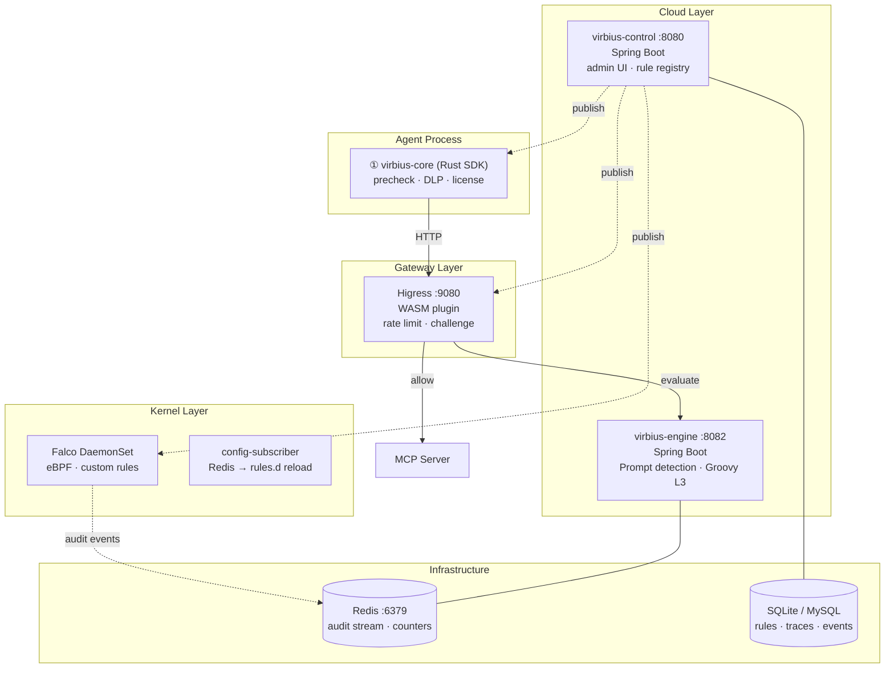

# VirbiusAgent

[](https://github.com/i1see1you/VirbiusAgent/actions/workflows/ci.yml)
[](https://github.com/i1see1you/VirbiusAgent/actions/workflows/codeql.yml)
[](LICENSE)
[](https://adoptium.net/)
[](https://www.rust-lang.org/)
[](https://go.dev/)

[中文文档](README.zh.md)

**VirbiusAgent** is a deep security protection platform for AI Agents. It provides end-to-end protection for MCP (Model Context Protocol) tool calls through an **Edge–Gateway–Kernel–Cloud** four-layer defense-in-depth architecture.

Built on the [VirbiusLLM](https://github.com/i1see1you/VirbiusLLM) security platform, VirbiusAgent extends LLM security to the AI Agent domain, covering tool-call preflight checks, runtime observability, and post-execution audits.

## Architecture



| Layer | Responsibility | Component |
|-------|---------------|-----------|
| **① Edge** | Tool-call precheck, license verification, allowlist, DLP masking, STI taint. Sub-ms, offline-capable. | `virbius-core` (Rust SDK) |
| **② Gateway** | Rate limiting, HTTP enforcement, challenge approval token validation. On-path. | `virbius-gateway` (Higress WASM) |
| **③ Kernel** | Runtime observability: file/process/network monitoring via eBPF. Custom Falco rules with canary deploy. | `virbius-kernel` (Falco plugin) |
| **④ Cloud** | Policy management, LLM-based prompt/DLP detection, Groovy L3 terminal adjudication, decision trace, audit dashboard. | `virbius-engine` + `virbius-control` (Spring Boot) |

## Features

| Capability | Phase | Description |
|-----------|-------|-------------|
| **MCP Secure Proxy** | P0 | stdio/SSE proxy + security pipeline (License + allowlist + engine adjudication) + multi-upstream routing |
| **Fast Path** | P0/P1 | Bypass cloud layer for low-risk tools, latency optimization |
| **Decision Trace** | P1 | Full-chain tool_call/tool_result tracing, session timeline + causal chain visualization |
| **Human Approval** | P1 | High-risk tool approval flow: engine challenge → console approve → token-gated execution |
| **Audit Dashboard** | P1 | Session risk, tool calls, alerts, approval queue, decision trace visualization |
| **Prompt Injection Detection** | P1 | Multi-LLM prompt injection detection with dynamic risk scoring |
| **STI Taint Tracking** | P1 | Track untrusted outputs across tool chains, prevent data leakage |
| **Hash Chain Audit** | P1 | Tamper-proof audit log with SHA-256 hash chain integrity verification |
| **Memory Interceptor** | P1/P2 | Desensitize sensitive data written to Agent memory |
| **Output Review** | P1/P2 | PII/credential leak detection in tool return values |
| **Falco Rules Management** | P1 | Custom eBPF rules managed through console with canary deployment |
| **Kernel Sandboxing** | P2 | Landlock + gVisor process isolation for high-risk tool execution |

## Quick Start

### Prerequisites

| Dependency | Version | Required for |
|-----------|---------|-------------|
| JDK | 17+ | Control plane, engine, compiler |
| Maven | 3.9+ | Java build |
| Rust | 1.80+ | virbius-core, virbius-mcp-proxy |
| Go | 1.22+ | WASM plugin (Gateway) |
| Redis | 7+ | Audit ingest, cumulative counters, cache |
| MySQL | 8+ | Production database (SQLite for dev) |

### Local Development

**Recommended — one-command setup:**

```bash
git clone https://github.com/i1see1you/VirbiusAgent.git && cd VirbiusAgent
bash scripts/run-local.sh      # builds Rust + Java, starts Redis, launches services
bash scripts/smoke-test.sh     # health check + test runner
```

**Manual step-by-step:**

```bash
# 1. Start Redis
docker run -d -p 6379:6379 redis:7-alpine

# 2. Build Java modules
mvn clean install -DskipTests

# 3. Build Rust modules
cargo build --release -p virbius-core -p virbius-mcp-proxy

# 4. Start control plane (SQLite in-memory, auto schema)
cd virbius-control
mvn spring-boot:run -Dspring-boot.run.profiles=local

# 5. Verify
curl -s http://localhost:8080/api/v1/health
```

### Edge SDK Demo

```toml
[dependencies]
virbius-core = { git = "https://github.com/i1see1you/VirbiusAgent" }
```

```bash
# Offline demo with fixture manifest
cd virbius-core
cargo run --example rust_client_demo

# Control sync (after run-local.sh + publishing edge rules)
export VIRBIUS_CONTROL_BASE_URL=http://127.0.0.1:8080
export VIRBIUS_TENANT_ID=default
export VIRBIUS_APP_ID=beta
cargo run --example rust_client_demo
```

## Deployment Architecture



| Component | Port | Stack | Role |
|-----------|------|-------|------|
| **virbius-core** | Embedded | Rust | Edge SDK: tool-call precheck, license verify, DLP, STI taint. Sub-ms, offline-capable. |
| **virbius-mcp-proxy** | 8083 | Rust (axum) | MCP stdio/SSE proxy: multi-upstream routing, security pipeline, session management. |
| **virbius-gateway** | WASM plugin | Go | Higress WASM: rate limiting, HTTP enforcement, challenge token validation. |
| **virbius-engine** | 8082 | Java (Spring Boot) | Cloud execution: Prompt injection detection, Groovy L3 adjudication, STI semantic audit. |
| **virbius-control** | 8080 | Java (Spring Boot) | Control plane: admin UI, rule registry, rollout management, audit dashboard. |
| **virbius-kernel** | eBPF plugin | Go (plugin) + Rust (sidecar) | Falco DaemonSet: custom eBPF rules, config-subscriber for live reload. |
| **Redis** | 6379 | — | Audit event stream, cumulative counters (rate limiting), session cache. |
| **Database** | — | SQLite / MySQL | Rule metadata, rollout state, agent traces, audit events. |

## Rule Runtimes

Each layer supports specific rule types, compiled by `virbius-compiler` into layer-specific artifacts:

| Layer | Runtime | Body Format | Use Case |
|-------|---------|-------------|----------|
| **Edge** | `lua-dsl` | JSON (`list_type` + `keywords`) | Keyword/allowlist matching. Sub-ms, offline-capable. |
| | `dlp-dsl` | JSON (`entity_type` + `pattern`) | PII desensitization (phone, ID, email, bank card). |
| **Gateway** | `lua` | Lua script (`function decide(ctx) ...`) | On-path firewall: access-list match, rate limiting, static content detection. |
| **Cloud** | `prompt` | NL description | LLM-based prompt injection and safety classification. |
| | `groovy` | Groovy script (`def decide(ctx) { ... }`) | Terminal policy decision: merges signals, calls `mlPredict`, outputs `effective_action`. |
| **Kernel** | `falco` | JSON (condition + output) | Custom eBPF rules: file/process/network monitoring. Canary deploy. |
| | Landlock / gVisor (P2) | JSON profile | Sandbox profiles for high-risk tool execution isolation. |

## Project Structure

```
virbius-agent/
├── virbius-core/          # Rust SDK — prechecks, DLP, license
├── virbius-mcp-proxy/     # Rust MCP proxy server
├── virbius-kernel/        # Rust/Golang — Falco plugin, sandbox
├── virbius-gateway/       # Go WASM plugin for Higress
├── virbius-control/       # Java Spring Boot control plane
├── virbius-engine/        # Java Spring Boot security engine
├── virbius-compiler/      # Java bundle compiler
├── virbius-policy/        # Java policy domain model
└── virbius-groovy-l3/     # Java Groovy L3 adjudicator
```

## Documentation

| Document | Description |
|----------|-------------|
| [USAGE_GUIDE.md](USAGE_GUIDE.md) | User guide — installation, integration, rule authoring, operations |
| [DESIGN.md](DESIGN.md) | System architecture design document |
| [ARCHITECTURE.md](ARCHITECTURE.md) | Detailed architecture documentation |
| [DEPLOYMENT.md](DEPLOYMENT.md) | Deployment topology and operations |
| [PROTOCOL.md](PROTOCOL.md) | MCP proxy protocol specification |
| [ROADMAP.md](ROADMAP.md) | Development roadmap and changelog |
| [CHANGELOG.md](CHANGELOG.md) | Version history |

## Contributing

See [CONTRIBUTING.md](CONTRIBUTING.md) for contribution guidelines.

## Security

See [SECURITY.md](SECURITY.md) for vulnerability reporting.

## License

MIT — Copyright (c) 2026 i1see1you
