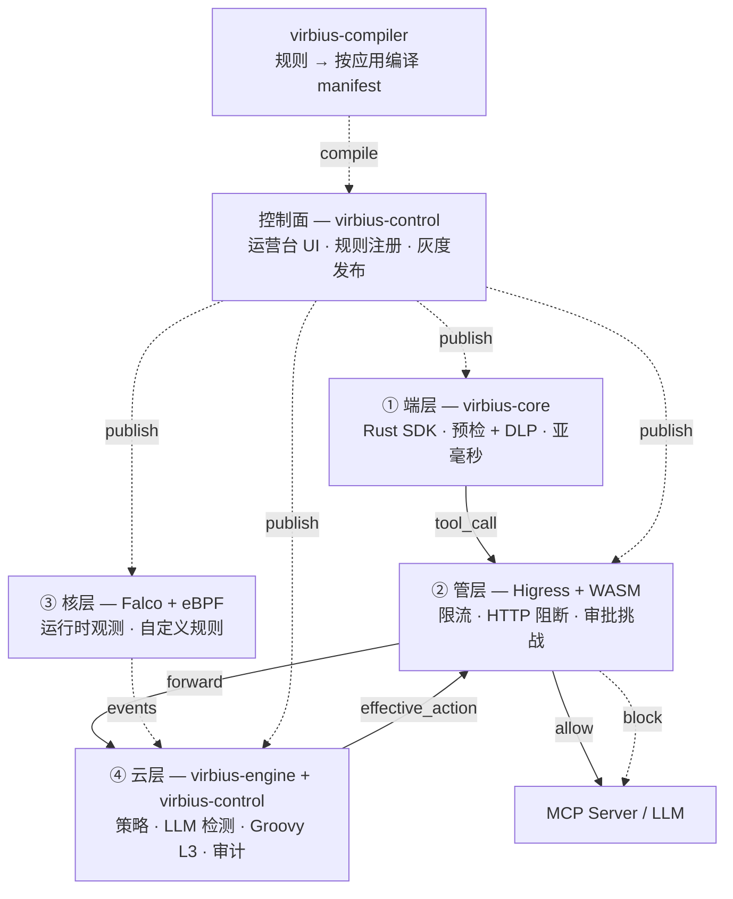
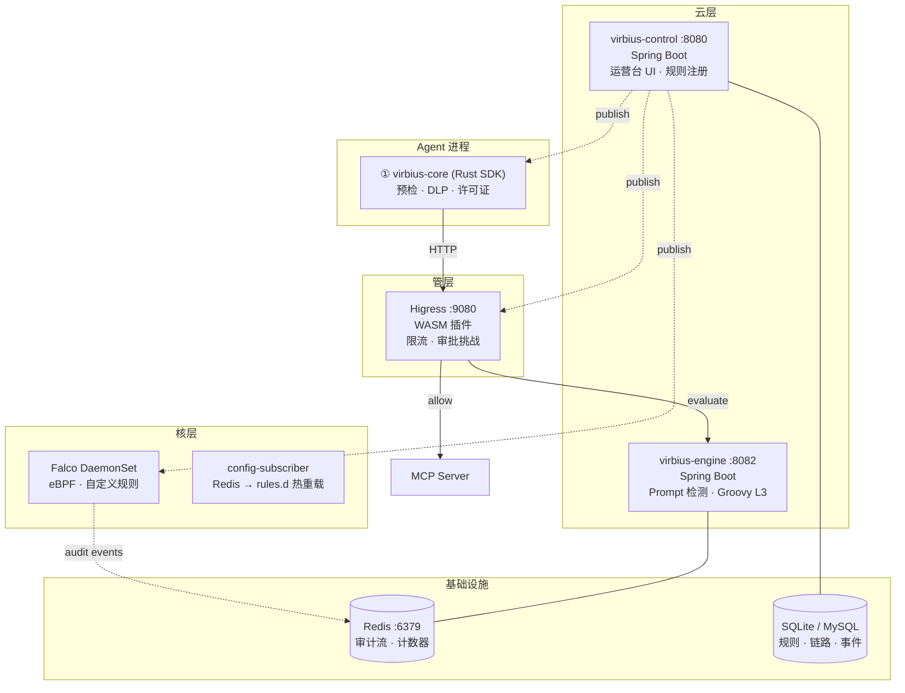

# VirbiusAgent

[](https://github.com/i1see1you/VirbiusAgent/actions/workflows/ci.yml)
[](https://github.com/i1see1you/VirbiusAgent/actions/workflows/codeql.yml)
[](LICENSE)
[](https://adoptium.net/)
[](https://www.rust-lang.org/)
[](https://go.dev/)

English: [README.md](README.md)

AI Agent 安全防护工具 — 端管核云四层架构，基于 [VirbiusLLM](https://github.com/i1see1you/VirbiusLLM) 基础平台。

**VirbiusAgent** 是面向 AI Agent 的深度安全防护平台，通过**端—管—核—云**四层纵深防御架构，为 MCP（Model Context Protocol）工具调用提供端到端保护。

基于 [VirbiusLLM](https://github.com/i1see1you/VirbiusLLM) 安全平台构建，VirbiusAgent 将 LLM 安全能力扩展到 AI Agent 领域，覆盖工具调用前置检查、运行时观测与执行后审计。

## 架构



| 层 | 组件 | 职责 |
|----|------|------|
| **① 端层** | virbius-core (Rust SDK) | 工具调用预检、许可证校验、allowlist、DLP 脱敏、STI 污点追踪。毫秒级，可离线。 |
| **② 管层** | virbius-gateway (Higress WASM) | 限流、HTTP 阻断、人工审批 token 验证。在线路径。 |
| **③ 核层** | virbius-kernel (Falco + eBPF) | 运行时观测：文件/进程/网络监控。自定义 Falco 规则灰度部署。 |
| **④ 云层** | virbius-engine + virbius-control (Spring Boot) | 策略管理、LLM 检测、Groovy L3 终判、决策链路、审计大盘。 |

## 核心能力

| 能力 | 说明 |
|------|------|
| MCP 安全代理 | stdio/SSE 代理 + 安全管线（License + allowlist + engine 终判）+ 多上游路由 |
| 快速通道 | 低风险工具跳过云层，延迟优化 |
| Agent 决策链路追踪 | tool_call/tool_result 全链路 trace，session 时间线 + 因果链可视化 |
| 高风险人工审批 | engine challenge → 运营台审批 → token 验证放行 |
| 运营台审计大盘 | session risk + 工具调用 + 告警 + 审批队列 + 决策链路可视化 |
| Prompt 注入检测 | 多 LLM 协同检测 + 动态风险评分 |
| STI Taint 污点追踪 | 跨工具追踪不可信输出，阻断数据泄漏 |
| Hash Chain 审计完整性 | SHA-256 哈希链审计日志防篡改 |
| 记忆管控 | Agent 写入记忆前的敏感数据脱敏 |
| 输出审查 | 工具返回值中的 PII/凭据泄漏检测 |
| Falco 规则管理 | 运营台统一管理 eBPF 规则，支持灰度部署 |

## 快速开始

### 依赖

| 工具 | 版本 | 用途 |
|------|------|------|
| JDK | 17+ | 控制面、引擎、编译器 |
| Maven | 3.9+ | Java 构建 |
| Rust | 1.80+ | virbius-core, virbius-mcp-proxy |
| Go | 1.22+ | WASM 插件 |
| Redis | 7+ | 审计消费、累计计数器、缓存 |
| MySQL | 8+ | 生产数据库（开发用 SQLite） |

### 本地启动

**一键启动（推荐）：**

```bash
git clone https://github.com/i1see1you/VirbiusAgent.git && cd VirbiusAgent
bash scripts/run-local.sh      # 构建 Rust + Java，启动 Redis 和服务
bash scripts/smoke-test.sh     # 健康检查 + 测试
```

**手动分步启动：**

```bash
# 1. 启动 Redis
docker run -d -p 6379:6379 redis:7-alpine

# 2. 构建 Java 模块
mvn clean install -DskipTests

# 3. 构建 Rust 模块
cargo build --release -p virbius-core -p virbius-mcp-proxy

# 4. 启动控制面（SQLite 内存模式，自动建表）
cd virbius-control
mvn spring-boot:run -Dspring-boot.run.profiles=local

# 5. 验证
curl -s http://localhost:8080/api/v1/health
```

### Edge SDK 示例

```toml
[dependencies]
virbius-core = { git = "https://github.com/i1see1you/VirbiusAgent" }
```

```bash
# 运行端到端集成测试（无需外部服务）
cd virbius-core
cargo test --test e2e_integration -- --nocapture
```

该测试套件覆盖完整的端层安全管线：License 验证 → 工具预检 → Prompt 网关 → MCP 执行 → STI 污点检测 → 审计链路追踪。

## 部署架构



| 组件 | 端口 | 技术栈 | 职责 |
|------|------|--------|------|
| virbius-core | 内嵌 | Rust | Edge SDK：工具预检、许可证校验、DLP、STI 污点追踪。毫秒级，可离线。 |
| virbius-mcp-proxy | 8083 | Rust (axum) | MCP stdio/SSE 代理：多上游路由、安全管线、会话管理。 |
| virbius-gateway | WASM 插件 | Go | Higress WASM：限流、HTTP 阻断、审批 token 验证。 |
| virbius-engine | 8082 | Java (Spring Boot) | 云端执行：Prompt 注入检测、Groovy L3 终判、STI 语义审计。 |
| virbius-control | 8080 | Java (Spring Boot) | 控制面：运营台 UI、规则注册、灰度管理、审计大盘。 |
| virbius-kernel | eBPF 插件 | Go + Rust | Falco DaemonSet：自定义 eBPF 规则，config-subscriber 热重载。 |
| Redis | 6379 | — | 审计事件流、累计计数器、会话缓存。 |
| 数据库 | — | SQLite / MySQL | 规则元数据、灰度状态、Agent 链路、审计事件。 |

## 规则运行时

| 层 | Runtime | Body 格式 | 用途 |
|----|---------|-----------|------|
| 端层 | `lua-dsl` | JSON（list_type + keywords） | 关键词/allowlist 匹配。毫秒级，可离线。 |
| | `dlp-dsl` | JSON（entity_type + pattern） | PII 脱敏（手机号、身份证、邮箱、银行卡）。 |
| 管层 | `lua` | Lua 脚本（`function decide(ctx) ...`） | 在线防火墙：名单匹配、限流、静态内容检测。 |
| 云层 | `prompt` | 自然语言描述 | LLM 安全分类 + Prompt 注入检测。 |
| | `groovy` | Groovy 脚本（`def decide(ctx) { ... }`） | 策略终判：合并各层信号、调用 `mlPredict`、输出 `effective_action`。 |
| 核层 | `falco` | JSON（condition + output） | 自定义 eBPF 规则：文件/进程/网络监控，支持灰度。 |
| | Landlock / gVisor (P2) | JSON 配置 | 高风险工具执行隔离沙箱配置。 |

## 项目结构

```
virbius-agent/
├── virbius-core/          # Rust SDK — 预检、DLP、许可证
├── virbius-mcp-proxy/     # Rust MCP 代理服务器
├── virbius-kernel/        # Rust/Golang — Falco 插件、沙箱
├── virbius-gateway/       # Go WASM 插件（Higress）
├── virbius-control/       # Java Spring Boot 控制面
├── virbius-engine/        # Java Spring Boot 安全引擎
├── virbius-compiler/      # Java 编译模块
├── virbius-policy/        # Java 策略领域模型
└── virbius-groovy-l3/     # Java Groovy L3 终判器
```

## 文档

| 文档 | 说明 |
|------|------|
| [USAGE_GUIDE.md](USAGE_GUIDE.md)（英文） | 使用指南 — 安装、集成、规则编写、运维 |
| [DESIGN.zh.md](DESIGN.zh.md) | 系统架构设计文档 |
| [ARCHITECTURE.zh.md](ARCHITECTURE.zh.md) | 详细架构说明 |
| [DEPLOYMENT.zh.md](DEPLOYMENT.zh.md) | 部署拓扑与运维 |
| [PROTOCOL.md](PROTOCOL.md)（英文） | MCP 代理协议规范 |
| [ROADMAP.md](ROADMAP.md)（英文） | 开发路线图与变更日志 |
| [CHANGELOG.md](CHANGELOG.md)（英文） | 版本历史 |

> 语言说明：DESIGN / ARCHITECTURE / DEPLOYMENT 提供中文版（点击上表链接）；USAGE_GUIDE、PROTOCOL、ROADMAP、CHANGELOG 目前仅提供英文版。

## 贡献指南

参见 [CONTRIBUTING.md](CONTRIBUTING.md)。

## 安全报告

参见 [SECURITY.md](SECURITY.md)。

## License

MIT — Copyright (c) 2026 i1see1you
