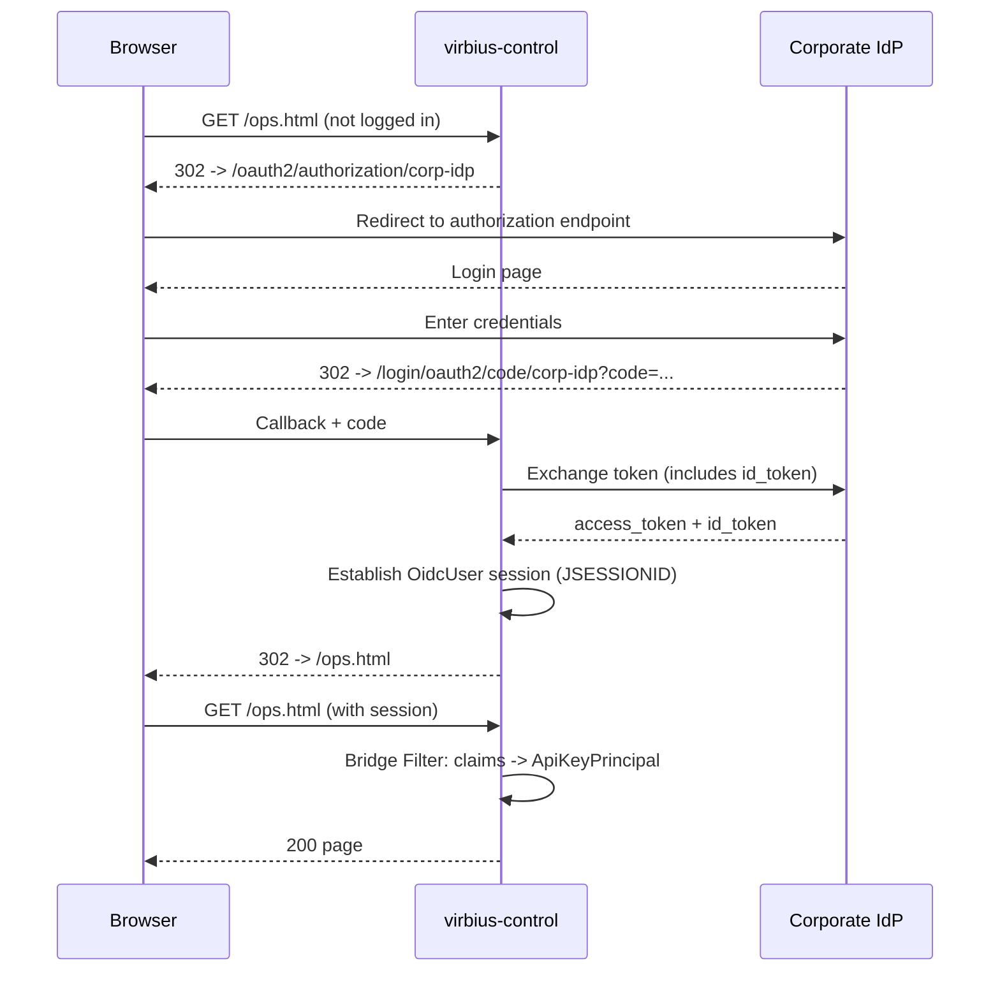
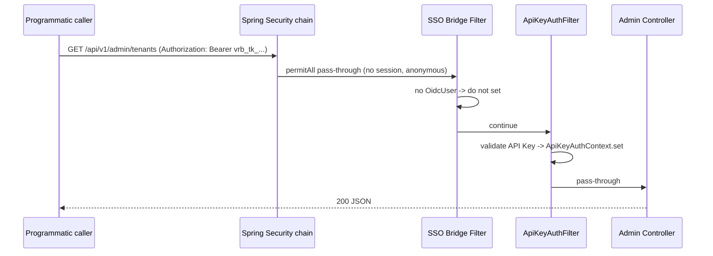

# VirbiusAgent Single Sign-On (OAuth2/OIDC) Integration — SSO INTEGRATION

| Item | Description |
|------|-------------|
| Document version | v0.1 |
| Status | Draft (pending implementation) |
| Related | [ARCHITECTURE.md](ARCHITECTURE.md) · [SECURITY.md](SECURITY.md) · [DEPLOYMENT.md](DEPLOYMENT.md) · [USAGE_GUIDE.md](USAGE_GUIDE.md) |
| Applies to | virbius-control (operations management console) |

> This document describes how to integrate the virbius-control operations management console with a corporate OAuth2/OIDC single sign-on (SSO), coexisting with the existing API Key authentication.

---

## 1. Background & Goals

### 1.1 Goals

- Integrate the **virbius-control operations management console UI** (`/ui`, `/ops`, `/ops.html`) with the corporate OAuth2/OIDC single sign-on.
- Map logged-in users to system roles based on the `groups`/`role` claim returned by the IdP, reusing the existing `ApiKeyRoutePolicy` path-based authorization logic.
- **Retain** the existing API Key mechanism for programmatic calls (engine->control, external integrations), coexisting with SSO without interference.

### 1.2 Protection Scope

| Scenario | Authentication Method |
|----------|----------------------|
| Operations staff accessing the console UI and its management API calls via browser | SSO session (OAuth2 Authorization Code + OIDC) |
| Programmatic API calls (inter-service, external integrations) | Existing API Key (`vrb_tk_`, unchanged) |

### 1.3 Non-Goals

- No changes to virbius-engine (currently no authentication, out of scope).
- No replacement of the API Key mechanism (programmatic calls still use API Keys).
- No separate frontend BFF/gateway (SSO is handled directly by virbius-control).

---

## 2. Current State Analysis

| Dimension | Current State | Impact |
|-----------|---------------|--------|
| Security framework | No Spring Security, fully custom | Need to introduce `spring-boot-starter-oauth2-client` |
| Authentication mechanism | `ApiKeyAuthFilter` (`io.virbius.control.api`), API Key (`vrb_tk_`, SHA-256 stored) | Retain, need dual-track compatibility |
| Default state | `virbius.security.api-key.enabled` defaults to `false`; when disabled, all requests go through `DEV_PRINCIPAL` | Dev unaffected |
| UI exposure | `static/ops.html`, via `OpsUiController` (`/ui`, `/ops` -> redirect to `/ops.html`) | Filter explicitly skips `/ui`, **currently no authentication at all** |
| Authorization model | `ApiKeyPrincipal`(credentialId, tenantId, role, label) + `ApiRole`(TENANT_VIEWER < TENANT_ADMIN < PLATFORM_ADMIN) + `ApiKeyRoutePolicy` | Reuse, SSO users map to the same model |
| Context | `ApiKeyAuthContext` (based on request attribute + RequestContextHolder) | SSO bridge reuses the same context |
| Path coverage | Filter only protects `/api/v1/admin/`, `/api/v1/edge/`, `/api/v1/gateway/`, `/api/v1/tenants/` | `/api/v1/challenges` etc. not covered (existing gap, see §10.3) |

### 2.1 Key Risk of Introducing Spring Security

`spring-boot-starter-oauth2-client` transitively brings in `spring-boot-starter-security`. Once the security starter is on the classpath, Spring Boot's `SecurityAutoConfiguration` will **lock down all endpoints by default** (default form login + random password), breaking existing dev/staging behavior.

**Mitigation**: Must explicitly define a `SecurityFilterChain` Bean to override default behavior, and provide two configurations toggled by `virbius.security.sso.enabled` (see §6.4).

---

## 3. Overall Design

### 3.1 Dual-Track Authentication Architecture

```
                         ┌─────────────────────────────────────────────┐
   Browser (ops staff) ─►│  Spring Security FilterChainProxy            │
                         │  ├─ OAuth2 Login (OIDC) -> establish OidcUser│
                         │  └─ SSO Bridge Filter -> map ApiKeyPrincipal │
                         │              ↓ write to ApiKeyAuthContext    │
                         ├─────────────────────────────────────────────┤
                         │  ApiKeyAuthFilter (existing, @Component)     │
                         │  Rule: if Context already set by SSO -> skip │
                         │        otherwise -> validate API Key         │
                         └──────────────────┬──────────────────────────┘
                                            ▼
                              Admin Controller (reuse ApiKeyRoutePolicy authz)

   Programmatic caller ───► (no session) goes straight to ApiKeyAuthFilter -> validate API Key
```

### 3.2 Design Highlights

1. **SSO protects the UI and browser-initiated management API calls**; API Key continues to protect programmatic calls. The two are arbitrated by whether `ApiKeyAuthContext` has already been populated.
2. **Reuse existing authorization model**: SSO users are bridged and mapped to `ApiKeyPrincipal`, and the downstream `ApiKeyRoutePolicy` role/tenant validation logic is reused as-is, with zero intrusion into business Controllers.
3. **Toggle-based**: `virbius.security.sso.enabled` controls whether SSO is active. When disabled (dev default), behavior is identical to the current state.

### 3.3 Filter Execution Order

Spring Security's `FilterChainProxy` registers at `HIGHEST_PRECEDENCE + 50`, executing before regular `@Component` Servlet Filters (default `LOWEST_PRECEDENCE`). Therefore:

```
Request -> [Spring Security chain (includes SSO Bridge Filter)] -> [ApiKeyAuthFilter] -> Controller
```

The bridge Filter executes within the Security chain and writes to `ApiKeyAuthContext`; subsequently `ApiKeyAuthFilter` reads the already-set value and skips, so the order is naturally correct.

## 4. Authentication Flow

### 4.1 Browser SSO Login



### 4.2 Browser Calls Management API (Logged In)

```mermaid
sequenceDiagram
    participant U as Browser (logged in)
    participant SF as Spring Security chain
    participant BF as SSO Bridge Filter
    participant AF as ApiKeyAuthFilter
    participant AC as Admin Controller
    U->>SF: GET /api/v1/admin/tenants (with JSESSIONID)
    SF->>BF: permitAll pass-through; SecurityContext contains OidcUser
    BF->>BF: claims -> ApiRole/tenant -> ApiKeyAuthContext.set
    BF->>AF: continue
    AF->>AF: detect Context already set -> skip
    AF->>AC: pass-through
    AC-->>U: 200 JSON
```

### 4.3 Programmatic API Call (API Key)



### 4.4 Logout

Triggering `POST /logout` (with CSRF token or relaxed via configuration) causes `OidcClientInitiatedLogoutSuccessHandler` to redirect to the IdP `end_session_endpoint`, clearing the local session before returning to `/ops.html` (logged-out state).

---

## 5. Path Protection Matrix

> Policy when SSO is enabled (`virbius.security.sso.enabled=true`).

| Path | Spring Security | SSO Bridge | ApiKeyAuthFilter | Notes |
|------|----------------|------------|------------------|-------|
| `/ui/**`, `/ops`, `/ops.html`, `/ui-hub.html`, legacy `.html` | **authenticated** | set | skip (`shouldNotFilter`) | Enforce SSO login |
| `/js/**`, `/css/**`, `/vendor/**`, favicon | permitAll | - | skip | Static resources |
| `/actuator/**`, `/api/v1/health`, `/api/v1/internal/**`, `/error` | permitAll | - | skip | Infrastructure |
| `/login/**`, `/oauth2/**`, `/logout` | permitAll | - | skip | SSO flow |
| `/api/v1/admin/**`, `/api/v1/edge/**`, `/api/v1/gateway/**`, `/api/v1/tenants/**` | permitAll | set if session | **dual-track**: skip if Context set, otherwise validate API Key | Browser via SSO, programmatic via API Key |
| Other (`/api/v1/challenges` etc.) | permitAll | - | skip | Existing uncovered paths (see §10.3) |

> SSO disabled (`virbius.security.sso.enabled=false`, dev default): Security chain permitAll for all, `ApiKeyAuthFilter` runs as before (`DEV_PRINCIPAL`), behavior unchanged.

## 6. Module Design

New classes are placed in the `io.virbius.control.security.sso` sub-package, alongside the existing `io.virbius.control.security`.

### 6.1 Dependency Change (virbius-control/pom.xml)

```xml
<dependency>
  <groupId>org.springframework.boot</groupId>
  <artifactId>spring-boot-starter-oauth2-client</artifactId>
</dependency>
```

> Transitively brings in `spring-boot-starter-security` + `oauth2-client` + `oauth2-jose` (OIDC parsing).

### 6.2 SsoProperties (Configuration Properties)

```java
@ConfigurationProperties(prefix = "virbius.security.sso")
public class SsoProperties {
    private boolean enabled = false;
    private String roleClaim = "groups";        // dot-path claim, e.g. "groups" or "realm_access.roles"
    private String tenantClaim = "tenant_id"; // Option A: dot-path for tenant id claim (tenant source)
    private String usernameClaim = "preferred_username"; // for principal label
    private Map<String, List<String>> roleMapping = new HashMap<>(); // role -> list of authorized claim values
    private String defaultRole = "";            // default role when no match; empty = deny
    // getters/setters
}
```

### 6.3 OidcRoleResolver (Role & Tenant Resolution)

Responsibility: Resolve `ApiRole` and tenant id from the `OidcUser`'s claims (**Option A: tenant from IdP claim**).

The two claims are orthogonal, both from the IdP: `roleClaim` (e.g. `groups`) determines the role, `tenantClaim` (e.g. `tenant_id`) determines the tenant.

- Extract the role set from claims by dot-path (`.` separated, supports nested paths like `realm_access.roles`).
- Match `roleMapping` from highest to lowest (PLATFORM_ADMIN -> TENANT_ADMIN -> TENANT_VIEWER): if the user's claim values intersect with the configured list, grant that role.
- **Platform admin takes priority**: if PLATFORM_ADMIN matches -> role=PLATFORM_ADMIN, tenant is forced to `TenantApiCredential.PLATFORM_TENANT` (`*`, all tenants), `tenantClaim` is not read.
- **Tenant user**: when platform admin is not matched, tenant is taken from `tenantClaim`, role is taken from groups mapping.
  - `tenantClaim` empty/missing -> **deny (return null, bridge Filter returns 403)** with message "No tenant assigned, please contact your administrator".
- No role match at all: return `defaultRole` (empty = deny 403).

> The resolution result is `(ApiRole role, String tenantId)`, used by the bridge Filter to construct `ApiKeyPrincipal`.

### 6.4 OidcPrincipalBridgeFilter (SSO Bridge Filter)

```java
@Component
public class OidcPrincipalBridgeFilter extends OncePerRequestFilter {
    // depends on OidcRoleResolver
    // registered within Security chain: addFilterAfter(this, AnonymousAuthenticationFilter.class)

    @Override
    protected void doFilterInternal(...) {
        Authentication auth = SecurityContextHolder.getContext().getAuthentication();
        if (auth != null && auth.getPrincipal() instanceof OidcUser oidcUser) {
            ResolvedRole resolved = resolver.resolve(oidcUser);
            if (resolved == null) {
                writeForbidden(response, "sso role not granted");   // logged in but no valid role -> 403
                return;
            }
            ApiKeyPrincipal principal = new ApiKeyPrincipal(
                "sso:" + oidcUser.getSubject(),
                resolved.tenantId(),
                resolved.role(),
                oidcUser.getPreferredUsername());
            ApiKeyAuthContext.set(request, principal);
        }
        filterChain.doFilter(request, response);
    }
}
```

### 6.5 SecurityFilterChain Configuration (Two Sets, Mutually Exclusive)

**SsoSecurityConfig** (`@ConditionalOnProperty(name="virbius.security.sso.enabled", havingValue="true")`):

```java
@Bean
SecurityFilterChain filterChain(HttpSecurity http,
        OidcPrincipalBridgeFilter bridgeFilter,
        ClientRegistrationRepository repo) throws Exception {
    http
        .authorizeHttpRequests(reg -> reg
            .requestMatchers("/ui/**", "/ops", "/ops.html", "/ui-hub.html",
                             "/access-lists.html", "/policies.html").authenticated()
            .requestMatchers("/js/**", "/css/**", "/vendor/**", "/favicon.ico",
                             "/actuator/**", "/api/v1/health", "/api/v1/internal/**",
                             "/error", "/login/**", "/oauth2/**", "/logout").permitAll()
            .requestMatchers("/api/v1/admin/**", "/api/v1/edge/**",
                             "/api/v1/gateway/**", "/api/v1/tenants/**").permitAll()
            .anyRequest().permitAll())
        .oauth2Login(Customizer.withDefaults())
        .logout(out -> out.logoutSuccessHandler(
            new OidcClientInitiatedLogoutSuccessHandler(repo)))
        .addFilterAfter(bridgeFilter, AnonymousAuthenticationFilter.class);
    // CSRF strategy see §10.1
    return http.build();
}
```

**OpenSecurityConfig** (`@ConditionalOnProperty(name="virbius.security.sso.enabled", havingValue="false", matchIfMissing=true)`):

```java
@Bean
SecurityFilterChain filterChain(HttpSecurity http) throws Exception {
    http.authorizeHttpRequests(reg -> reg.anyRequest().permitAll())
        .csrf(csrf -> csrf.disable());
    return http.build();
}
```

> This configuration only neutralizes the security starter's default lockdown, keeping dev behavior unchanged.

### 6.6 ApiKeyAuthFilter Modification (Minimal Intrusion)

Add a short-circuit at the beginning of `doFilterInternal`:

```java
@Override
protected void doFilterInternal(...) {
    if (ApiKeyAuthContext.current() != null) {
        // Already set by SSO bridge, skip API Key validation
        filterChain.doFilter(request, response);
        return;
    }
    // ... existing logic unchanged
}
```

The rest of the logic (token extraction, role/tenant validation, DEV_PRINCIPAL) remains unchanged.

## 7. Configuration Design

### 7.1 application.yml (Common, toggle defaults to off)

```yaml
virbius:
  security:
    sso:
      enabled: ${VIRBIUS_SSO_ENABLED:false}
      role-claim: ${VIRBIUS_SSO_ROLE_CLAIM:groups}
      tenant-claim: ${VIRBIUS_SSO_TENANT_CLAIM:tenant_id}  # Option A: tenant source claim; empty denies tenant users
      username-claim: ${VIRBIUS_SSO_USERNAME_CLAIM:preferred_username}
      role-mapping:
        platform-admin: [virbius-platform-admin, admin]
        tenant-admin: [virbius-tenant-admin]
        tenant-viewer: [virbius-tenant-viewer]
      default-role: ${VIRBIUS_SSO_DEFAULT_ROLE:}   # empty = deny

spring:
  security:
    oauth2:
      client:
        registration:
          corp-idp:
            client-id: ${VIRBIUS_SSO_CLIENT_ID}
            client-secret: ${VIRBIUS_SSO_CLIENT_SECRET}
            scope: openid,profile,email
        provider:
          corp-idp:
            issuer-uri: ${VIRBIUS_SSO_ISSUER_URI}
```

### 7.2 Profile Configuration

| Profile | `virbius.security.sso.enabled` | `virbius.security.api-key.enabled` | Notes |
|---------|-------------------------------|------------------------------------|-------|
| dev (default) | `false` | `false` | Unchanged, DEV_PRINCIPAL |
| staging | `true` | `true` | SSO + API Key dual-track |
| prod | `true` | `true` | SSO + API Key dual-track |

> In prod, you must first issue a PLATFORM_ADMIN API Key per §11.1 step 3 before enabling `api-key.enabled=true`, otherwise admin API and edge/gateway API will have no available authentication method.
> For staging/prod, append `virbius.security.sso.enabled: true` and IdP connection info to `application-staging.yml` and `application-prod.yml` (all injected via environment variables).

### 7.3 IdP-Side Registration

Register an OAuth2 client with the corporate IdP, configuring the callback URL:

```
https://<control-host>/login/oauth2/code/corp-idp
```

Obtain `client-id` / `client-secret`, and confirm the `issuer-uri` (must include `.well-known/openid-configuration`).

---

## 8. Role Mapping Design

### 8.1 Mapping Flow (Option A: Tenant from IdP claim)

```
OidcUser.claims
   │
   ├─ Extract role set by roleClaim dot-path (Set<String>)
   │     e.g.: groups = ["virbius-tenant-admin", "dev-team"]
   │     e.g.: realm_access.roles = ["virbius-platform-admin"]   (Keycloak nested)
   │
   ├─ Match roleMapping from highest to lowest:
   │     PLATFORM_ADMIN config list ∩ user set non-empty?
   │       -> role = PLATFORM_ADMIN,  tenant = "*" (all tenants, tenantClaim not read)
   │     else TENANT_ADMIN ... -> role = TENANT_ADMIN
   │     else TENANT_VIEWER ... -> role = TENANT_VIEWER
   │     none match -> defaultRole (empty = deny 403)
   │
   └─ Tenant user (non-platform-admin):
        tenant = tenantClaim dot-path value   (e.g. "acme")
        tenant empty/missing? -> deny (403, "no tenant assigned")
```

### 8.2 Configuration Example (Keycloak)

```yaml
virbius.security.sso:
  role-claim: realm_access.roles
  tenant-claim: tenant_id
  role-mapping:
    platform-admin: [virbius-platform-admin, realm-admin]
    tenant-admin: [virbius-tenant-admin]
    tenant-viewer: [virbius-tenant-viewer]
  default-role: tenant-viewer
```

### 8.3 Mapping to ApiKeyPrincipal

| Field | Source |
|-------|--------|
| credentialId | `"sso:" + oidcUser.getSubject()` |
| tenantId | Platform admin = `*`; tenant user = `tenantClaim` value (deny 403 if missing) |
| role | Resolved `ApiRole` (from groups claim mapping) |
| label | Value of `usernameClaim` (e.g. `preferred_username`) |

> This principal is written directly to `ApiKeyAuthContext`, and the downstream `ApiKeyRoutePolicy.requiredRole()` / `tenantScopeAllowed()` takes effect as-is — **no changes needed in business Controllers**.

### 8.4 Tenant Determination & Isolation (Option A: Tenant from IdP claim)

#### 8.4.1 Rationale

After evaluation, aside from platform admins, **essentially each person accesses only one tenant**, and tenant ownership can be delivered by the corporate IdP as a claim. Therefore **Option A** is adopted: tenant id comes directly from the IdP's `tenantClaim`, with no local mapping table on the virbius side. The advantage is zero DB, zero management interface, and immediate availability upon login; the tradeoff is that tenant ownership is maintained on the IdP side (changing tenants requires an IdP attribute change).

> Alternative Option B (local mapping table `tb_sso_user_tenant`) is reserved for future expansion: if individual "one person, multiple tenants" exceptions arise or virbius-side overrides are needed, a local fallback table can be layered on without affecting the main flow.

#### 8.4.2 Tenant Determination

| User type | tenantId source | role source |
|-----------|----------------|-------------|
| Platform admin | `*` (PLATFORM_TENANT, all tenants) | `roleClaim` matches platform-admin group |
| Tenant user | `tenantClaim` value (e.g. `acme`) | `roleClaim` maps to TENANT_ADMIN/VIEWER |
| Tenant user but `tenantClaim` missing | — | Deny (403 "no tenant assigned") |

- Platform admin determination takes **priority**: once groups match the platform-admin group, tenant is forced to `*`, and `tenantClaim` is not read.
- Tenant user with empty/missing `tenantClaim` is **safely denied** (403), preventing accidental access without a tenant context.

#### 8.4.3 Isolation Enforcement (Existing Mechanism Auto-Applies)

Tenant isolation **requires no new logic** — it is enforced by the existing `ApiKeyRoutePolicy.tenantScopeAllowed` (`ApiKeyRoutePolicy.java:82`):

```
Non-platform users: credentialTenantId must == pathTenantId in the URL, otherwise 403
Platform admin / tenant "*": allow all
```

Most tenant-scoped resource endpoints follow the `/api/v1/admin/tenants/{tenantId}/...` pattern (rules, access lists, rollout, audit, monitoring, license, gateway artifacts, etc.). The tenantId is in the path, extracted by `extractPathTenantId`, then validated by `tenantScopeAllowed`. Once the SSO principal carries the correct tenantId, **cross-tenant paths return 403 directly**.

> Platform-level endpoints (`/api/v1/admin/tenants` list, create tenant, platform credentials) require PLATFORM_ADMIN via `requiredRole`, making them naturally unreachable by tenant users.

#### 8.4.4 Service-Layer Defense Gaps (Recommended Before SSO Go-Live)

The introduction of human users via SSO elevates privilege escalation risk. Existing isolation is only at the filter path layer; the service layer has no secondary validation. Two existing gaps are recommended for service-layer hardening:

| Gap | Location | Problem | Recommendation |
|-----|----------|---------|----------------|
| License revocation | `LicenseAdminController.java:52` | Only passes `licenseId` without tenantId; service layer operates by licenseId; path policy blocks path tenant, but if licenseId belongs to another tenant, it causes unauthorized write | Service layer should validate license's tenantId == principal.tenantId (for non-platform users) |
| Global ingest status | `RolloutAdminController` `GET /trace/ingest-status` | Returns global platform status, no tenantId | Restrict to PLATFORM_ADMIN, or filter by tenant |

> These are **existing issues**, not introduced by SSO; but SSO enables human tenant users to reach these endpoints, so fixing them in the same cycle is recommended.

#### 8.4.5 UI Tenant Constraint: whoami Endpoint

After logging into the console UI, the frontend needs to know the current user's tenant/role to determine display. Add a general-purpose endpoint (usable by both SSO and API Key):

```
GET /api/v1/auth/me   -> { subject, tenantId, role, label }   // from ApiKeyAuthContext
```

UI calls `/me` on startup:
- **TENANT_ADMIN / TENANT_VIEWER**: hide tenant switcher, use own tenantId in API path calls; hide platform-level menus (tenant management, platform credentials).
- **PLATFORM_ADMIN** (tenant `*`): show tenant list/switcher, can operate on any tenant.

> `/api/v1/auth/me` is not within `ApiKeyAuthFilter`'s current coverage paths. It needs to be included in authorization (SSO bridge already set -> allow; API Key -> validate), or placed under the `/api/v1/admin/` prefix to reuse the existing mechanism.

#### 8.4.6 IdP-Side Prerequisites

Option A depends on the IdP being able to deliver tenant attributes. Before go-live, confirm with the IdP administrator:

1. Whether there is an existing user attribute that can correspond to a virbius tenant (department/organization/custom attribute).
2. Whether it can be released as a claim for this OIDC client (into id_token / userinfo).
3. The field name of this claim (to be set in `VIRBIUS_SSO_TENANT_CLAIM`).
4. Whether each target user has the correct virbius tenant value configured.

## 9. Conflict Handling & Compatibility

### 9.1 SSO vs API Key Arbitration

- **Arbitration point**: whether `ApiKeyAuthContext.current()` has already been set.
- SSO bridge Filter executes first and sets the value -> `ApiKeyAuthFilter` detects it and short-circuits.
- Programmatic calls have no session -> bridge does not set -> `ApiKeyAuthFilter` goes through API Key validation.
- The two never trigger simultaneously; no duplicate authentication.

### 9.2 Existing Gaps Retained

`ApiKeyAuthFilter.shouldNotFilter` currently allows `/ui`, `/api/v1/internal/`, `/api/v1/health`, etc.; after SSO is enabled, `/ui` is taken over by Spring Security, and the remaining allowed paths behave unchanged. `/api/v1/challenges` is still not covered by API Key (existing gap, §10.3).

### 9.3 Dev Behavior Unchanged

When `virbius.security.sso.enabled=false` (default), `OpenSecurityConfig` takes effect — Security chain permitAll for all + CSRF disabled, `ApiKeyAuthFilter` goes through `DEV_PRINCIPAL`, completely identical to pre-change behavior.

### 9.4 Admin Role Restriction: SSO User Browser Access to Admin API

SSO-logged-in users calling `/api/v1/admin/**`, `/api/v1/tenants/**` via browser **must have `TENANT_ADMIN` or above**. The implementation is as follows:

| Auth Method | Admin API Admission Condition | Denial Result |
|-------------|-------------------------------|---------------|
| **OIDC session** (browser) | `ApiRole` resolved by `OidcRoleResolver` must be >= `TENANT_ADMIN` | `OidcPrincipalBridgeFilter` returns 403 |
| **API Key** (programmatic) | `ApiKeyAuthFilter` validates `credential.role()` satisfies `ApiKeyRoutePolicy.requiredRole()` | 401/403 per path |

**Complete flow for browser SSO calls to admin API**:

```
Browser AJAX GET /api/v1/admin/tenants/{t}/rules (with JSESSIONID)
  -> Security: permitAll (pass-through, does not require authenticated)
  -> OidcPrincipalBridgeFilter: OidcUser in SecurityContext?
      ├─ No (no session) -> do not set, continue
      └─ Yes (logged in) -> OidcRoleResolver resolves role + tenant
           ├─ role = TENANT_VIEWER -> return 403 (insufficient role, cannot manage)
           └─ role >= TENANT_ADMIN -> set ApiKeyAuthContext, continue
  -> ApiKeyAuthFilter: Context already set -> skip
  -> Admin Controller: normal processing
```

> `ApiKeyRoutePolicy` requires `TENANT_VIEWER` for `GET` and `TENANT_ADMIN` for `POST/PUT/DELETE`. However, the SSO bridge Filter **uniformly requires >= `TENANT_ADMIN`** for role admission, because browser users entering the console via SSO should have management operation capability; "read-only viewing" scenarios (TENANT_VIEWER) are not covered by SSO — such needs should use API Key or be evaluated separately.

---

## 10. Security Considerations

### 10.1 CSRF

Spring Security enables CSRF by default. The console UI (`ops.html`) sends POST requests via `fetch`, and the existing JS **does not carry a CSRF token**, which would cause all write operations to return 403. Two options:

| Option | Approach | Suitable For |
|--------|----------|-------------|
| A. Relax CSRF (recommended initially) | `http.csrf(csrf -> csrf.ignoringRequestMatchers("/api/**"))`, rely on SameSite=Lax session cookie + API Key to protect write operations | Quick go-live, internal network |
| B. Integrate CSRF token (recommended for production) | Expose `/api/v1/csrf` endpoint returning token, frontend JS sends `X-XSRF-TOKEN` header | Full protection |

> Option A is the default; switch to Option B later if enhanced protection is needed (requires updating the request wrapper in `static/js/ops-common.js`).

### 10.2 Session Storage

- Default in-memory sessions (suitable for single instance).
- Multi-instance deployment requires shared sessions: the project already uses Redis; `spring-session-data-redis` + `jedis` can be introduced to back `JSESSIONID` with Redis, enabling session sharing and coordinated invalidation.
- Session timeout should be configured via `server.servlet.session.timeout` (e.g. 30m).

### 10.3 Existing Uncovered Paths

Paths like `/api/v1/challenges` are not covered by `ApiKeyAuthFilter`, and after SSO is enabled, they are permitAll in the Security chain. If protection is needed, it should be evaluated separately (the challenge flow may be called back by the engine internally and needs to be allowed). This is kept as-is for now, marked as a TODO.

### 10.4 HTTPS

SSO callbacks and redirects must use HTTPS (IdPs typically enforce this). In production, TLS is terminated at the Ingress layer; virbius-control can listen on HTTP, but `server.forward-headers-strategy: native` must be configured to correctly recognize `X-Forwarded-*` headers.

### 10.5 Audit

Operation audit for SSO-logged-in users: the existing audit pipeline is based on `ApiKeyPrincipal`; after bridging, the principal's `credentialId` is in the form `sso:<sub>` and `label` is the username. Audit logs can naturally distinguish SSO users from API Key callers, requiring no additional changes.

---

## 11. Deployment & Migration

### 11.1 Go-Live Steps

1. **IdP Registration**: Create a client with the corporate IdP, callback URL `https://<host>/login/oauth2/code/corp-idp`, obtain client-id/secret.
2. **Configuration Injection**: Inject the following variables in staging/prod environments:
   ```
   VIRBIUS_SSO_ENABLED=true
   VIRBIUS_SSO_CLIENT_ID=...
   VIRBIUS_SSO_CLIENT_SECRET=...
   VIRBIUS_SSO_ISSUER_URI=https://idp.corp.com/realms/...
   VIRBIUS_SSO_ROLE_CLAIM=realm_access.roles   # per actual IdP field
   VIRBIUS_SSO_DEFAULT_ROLE=                   # as needed
   ```
3. **Initialize PLATFORM_ADMIN API Key** (mandatory first-deployment step):

   API Key is the credential for server-side calls (Edge SDK / MCP Proxy) and admin API fallback authentication. **It must be issued before SSO is enabled.** Leverage the `DEV_PRINCIPAL` backdoor when authentication is disabled:

   ```bash
   # After first deployment, VIRBIUS_SECURITY_API_KEY_ENABLED defaults to false (auth disabled)
   curl -X POST http://localhost:8080/api/v1/admin/platform/api-credentials \
     -H 'Content-Type: application/json' \
     -d '{"label": "prod-admin"}'
   # Returns: { "api_key": "vrb_tk_Ab12...XXXX", "tenant_id": "*", "role": "platform_admin", ... }
   # Store api_key in a password manager / environment variable; visible only this once
   ```

   > If the API Key is lost, repeat the above steps to issue a new Key and revoke the old one; or temporarily set `VIRBIUS_SECURITY_API_KEY_ENABLED=false` and restart to re-issue (not recommended in production).

4. **Enable API Key Authentication**:

   ```yaml
   # application-prod.yml
   virbius.security.api-key.enabled: true
   ```

   Or environment variable `VIRBIUS_SECURITY_API_KEY_ENABLED=true`.

5. **Deploy**: Build and deploy virbius-control (with new dependencies and configuration).
6. **Verify**:
   - Browser access to `https://<host>/ops.html` should redirect to IdP login, then redirect back to the console after login.
   - Programmatic calls with API Key work normally (`Authorization: Bearer vrb_tk_...`).
   - Calls to edge/admin API without API Key should return 401.
7. **Gradual Rollout**: Validate role mapping and audit logs in staging first, then push to prod.

### 11.2 Production Key Management

| Operation | Command |
|-----------|---------|
| Issue tenant-level Key | `POST /api/v1/admin/tenants/{tenantId}/api-credentials` (requires platform or tenant admin Key) |
| Issue platform-level Key | `POST /api/v1/admin/platform/api-credentials` (requires platform admin Key) |
| Revoke Key | `POST /api/v1/admin/platform/api-credentials/{id}/revoke` |
| List Keys | `GET /api/v1/admin/platform/api-credentials` |

> Each API Key belongs to one tenant (`tenantId`); platform-level Key has `tenantId` = `*` and can manage all tenants.
> The secret is **returned only once at issuance**; if lost, it can only be revoked and re-created.

### 11.3 Rollback

Set `VIRBIUS_SSO_ENABLED` to `false` and restart to roll back to pure API Key mode (`OpenSecurityConfig` takes effect). SSO-related classes remain in the codebase but are inactive, with no side effects.

### 11.4 Backward Compatibility

- Programmatic callers (engine, external integrations) **require no changes** — they continue using API Keys.
- Existing API Key CRUD interfaces are unchanged.
- Dev environment requires no IdP, behavior unchanged.

---

## 12. Testing Plan

### 12.1 Unit Tests

| Test Target | Coverage |
|-------------|----------|
| `OidcRoleResolver` | Dot-path extraction (including `realm_access.roles` nesting), highest-priority role matching, no-match fallback to defaultRole, empty defaultRole returns null, tenant extraction |
| `OidcPrincipalBridgeFilter` | Sets `ApiKeyAuthContext` when OidcUser present; does not set when no OidcUser; returns 403 when resolved is null |
| `ApiKeyAuthFilter` (modified) | Short-circuits when Context already set; goes through original API Key logic when not set |

### 12.2 Integration Tests

Using `spring-security-test`'s `@WithMockOAuth2User` or `MockMvc` + `OidcUser` mock:

- Access `/ops.html` without login -> 302 to IdP.
- Access `/ops.html` after simulated login -> 200.
- GET `/api/v1/admin/tenants` after simulated login -> 200 (bridge sets value, filter short-circuits).
- Call same endpoint with API Key -> 200 (goes through API Key path).
- Logged in but role mismatch -> 403.

### 12.3 Manual Verification Checklist

- [ ] Browser access to `/ui`, `/ops.html` redirects to IdP login
- [ ] After successful login, redirect back to console, page loads normally
- [ ] API calls from console function pages (rules, tenants, audit, etc.) return 200
- [ ] After logout, returns to logged-out state, subsequent access is blocked
- [ ] Programmatic calls with API Key to admin API work normally
- [ ] Audit logs identify SSO users as `sso:<sub>`
- [ ] When `VIRBIUS_SSO_ENABLED=false`, dev behavior is unchanged

---

## 13. Open Items

| # | Item | Notes |
|---|------|-------|
| 1 | IdP role claim field name | Is it `groups`, `roles`, or `realm_access.roles`? Confirm with IdP administrator |
| 2 | Mapping between claim values and system roles | Which IdP groups/roles map to PLATFORM_ADMIN / TENANT_ADMIN / TENANT_VIEWER |
| 3 | IdP tenant claim field name (Option A decided) | Option A adopted (tenant from IdP claim); field name and per-user virbius tenant value to be confirmed (see §8.4.6) |
| 4 | CSRF strategy | Adopt Option A (relaxed) or B (integrate token), whether frontend JS needs modification |
| 5 | Session storage | Is single-instance in-memory sufficient, or is Redis shared session needed (multi-instance) |
| 6 | Whether `/api/v1/challenges` should be protected | Existing gap, needs evaluation of challenge callback source before deciding |
| 7 | HTTPS / reverse proxy | Whether production Ingress terminates TLS, whether `forward-headers` is configured |
| 8 | Service-layer tenant defense gaps | `LicenseAdminController.revoke` unauthorized write by licenseId, `trace/ingest-status` globally visible; recommend adding service-layer validation before SSO go-live (see §8.4.4) |
| 9 | whoami endpoint authorization | `GET /api/v1/auth/me` needs to be included in authorization coverage (see §8.4.5) |

---

## Appendix A: File Inventory

| File | Type | Description |
|------|------|-------------|
| `virbius-control/pom.xml` | Modify | Add `spring-boot-starter-oauth2-client` dependency |
| `io/virbius/control/security/sso/SsoProperties.java` | New | SSO configuration properties |
| `io/virbius/control/security/sso/OidcRoleResolver.java` | New | Role/tenant resolution (groups for role + tenantClaim for tenant, Option A) |
| `io/virbius/control/security/sso/OidcPrincipalBridgeFilter.java` | New | SSO bridge Filter |
| `io/virbius/control/config/SsoSecurityConfig.java` | New | SecurityFilterChain when SSO enabled |
| `io/virbius/control/config/OpenSecurityConfig.java` | New | permitAll configuration when SSO disabled |
| `io/virbius/control/api/ApiKeyAuthFilter.java` | Modify | Add Context short-circuit at beginning of doFilterInternal |
| `io/virbius/control/api/AuthMeController.java` | New | `GET /api/v1/auth/me` whoami endpoint (see §8.4.5) |
| `LicenseService` / `RolloutAdminController` | Modify | Add service-layer tenant validation (license revocation, trace ingest-status, see §8.4.4) |
| `virbius-control/src/main/resources/application.yml` | Modify | Add `virbius.security.sso` and `spring.security.oauth2.client` config blocks |
| `application-staging.yml` / `application-prod.yml` | Modify | `virbius.security.sso.enabled: true` |

## Appendix B: Environment Variable Quick Reference

| Variable | Required | Description |
|----------|----------|-------------|
| `VIRBIUS_SSO_ENABLED` | No | `true` to enable SSO, default `false` |
| `VIRBIUS_SSO_CLIENT_ID` | When enabled | IdP client ID |
| `VIRBIUS_SSO_CLIENT_SECRET` | When enabled | IdP client secret |
| `VIRBIUS_SSO_ISSUER_URI` | When enabled | IdP issuer (must include `.well-known/openid-configuration`) |
| `VIRBIUS_SSO_ROLE_CLAIM` | No | Role claim dot-path, default `groups` |
| `VIRBIUS_SSO_TENANT_CLAIM` | No | Tenant claim dot-path, default empty |
| `VIRBIUS_SSO_USERNAME_CLAIM` | No | Username claim, default `preferred_username` |
| `VIRBIUS_SSO_DEFAULT_ROLE` | No | Default role when no match, default empty (deny) |
| `VIRBIUS_SECURITY_API_KEY_ENABLED` | No | Enable API Key authentication, default `false`; prod requires issuing Key first before enabling |
