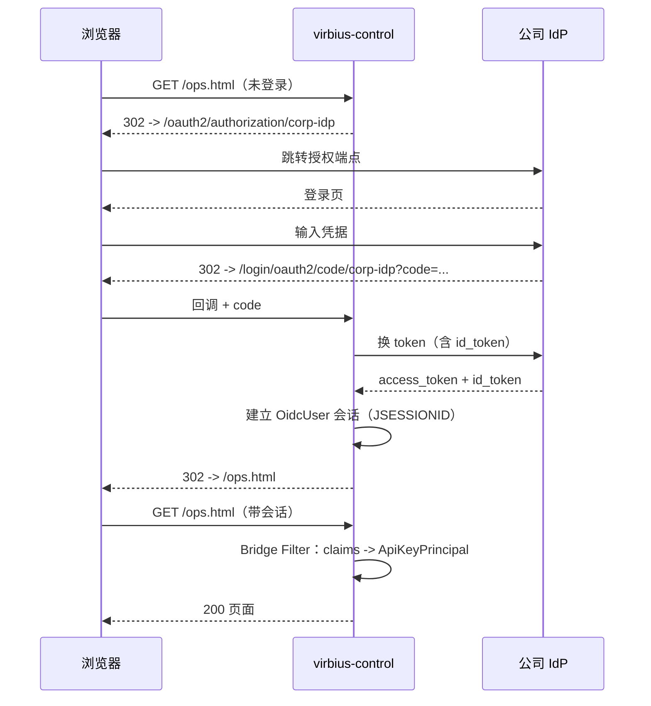
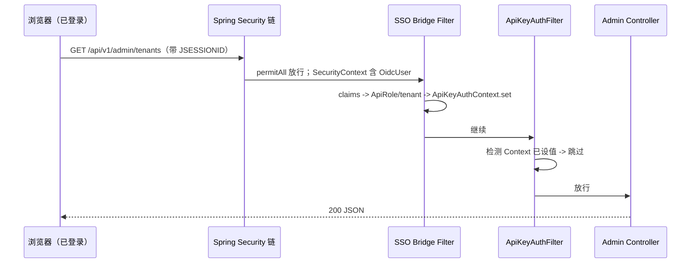
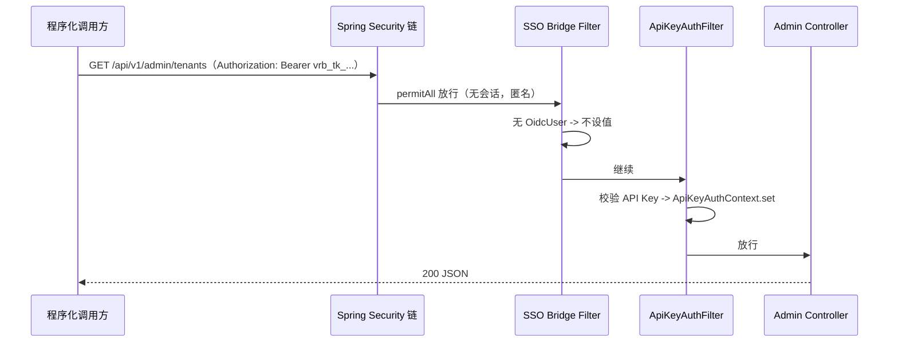

# VirbiusAgent 统一登录（OAuth2/OIDC）接入方案 - SSO INTEGRATION

| 项目 | 说明 |
|------|------|
| 文档版本 | v0.1 |
| 状态 | 草案（待实现） |
| 关联 | [ARCHITECTURE.zh.md](ARCHITECTURE.zh.md) · [SECURITY.md](SECURITY.md) · [DEPLOYMENT.zh.md](DEPLOYMENT.zh.md) · [USAGE_GUIDE.md](USAGE_GUIDE.md) |
| 适用组件 | virbius-control（运营管理后台） |

> 本文档描述如何将 virbius-control 运营管理后台接入公司 OAuth2/OIDC 统一登录（SSO），与现有 API Key 认证双轨并存。

---

## 1. 背景与目标

### 1.1 目标

- 将 **virbius-control 运营管理后台 UI**（`/ui`、`/ops`、`/ops.html`）接入公司 OAuth2/OIDC 统一登录。
- 登录用户按 IdP 返回的 `groups`/`role` claim 映射为系统角色，复用现有 `ApiKeyRoutePolicy` 路径鉴权逻辑。
- **保留**现有 API Key 机制服务程序化调用（engine->control、外部集成），与 SSO 双轨并存，互不干扰。

### 1.2 保护范围

| 场景 | 认证方式 |
|------|---------|
| 运营人员浏览器访问后台 UI 及其调用的管理 API | SSO 会话（OAuth2 Authorization Code + OIDC） |
| 程序化 API 调用（服务间、外部集成） | 现有 API Key（`vrb_tk_`，不变） |

### 1.3 非目标

- 不改造 virbius-engine（当前无认证，不在本期范围）。
- 不替换 API Key 机制（程序化调用仍用 API Key）。
- 不引入独立的前端 BFF/网关（SSO 直接由 virbius-control 承接）。

---

## 2. 现状分析

| 维度 | 现状 | 影响 |
|------|------|------|
| 安全框架 | 无 Spring Security，全自研 | 需引入 `spring-boot-starter-oauth2-client` |
| 认证机制 | `ApiKeyAuthFilter`（`io.virbius.control.api`），API Key（`vrb_tk_`，SHA-256 入库） | 保留，需做双轨兼容 |
| 默认状态 | `virbius.security.api-key.enabled` 默认 `false`，关闭时全部走 `DEV_PRINCIPAL` | dev 不受影响 |
| UI 暴露 | `static/ops.html`，经 `OpsUiController`（`/ui`、`/ops` -> 重定向 `/ops.html`） | filter 显式跳过 `/ui`，**当前完全无认证** |
| 鉴权模型 | `ApiKeyPrincipal`(credentialId, tenantId, role, label) + `ApiRole`(TENANT_VIEWER < TENANT_ADMIN < PLATFORM_ADMIN) + `ApiKeyRoutePolicy` | 复用，SSO 用户映射为同一模型 |
| 上下文 | `ApiKeyAuthContext`（基于 request attribute + RequestContextHolder） | SSO 桥接复用同一上下文 |
| 路径覆盖 | filter 仅保护 `/api/v1/admin/`、`/api/v1/edge/`、`/api/v1/gateway/`、`/api/v1/tenants/` | `/api/v1/challenges` 等未覆盖,无影响 |

### 2.1 引入 Spring Security 的关键风险

`spring-boot-starter-oauth2-client` 会传递引入 `spring-boot-starter-security`。一旦 classpath 出现 security starter，Spring Boot 的 `SecurityAutoConfiguration` 会**默认锁定全部端点**（默认表单登录 + 随机密码），破坏 dev/staging 现有行为。

**对策**：必须显式定义 `SecurityFilterChain` Bean 覆盖默认行为，并按 `virbius.security.sso.enabled` 开关提供两套配置（见 §6.4）。

---

## 3. 总体设计

### 3.1 双轨认证架构

```
                         ┌─────────────────────────────────────────────┐
   浏览器（运营人员） ───►│  Spring Security FilterChainProxy            │
                         │  ├─ OAuth2 Login（OIDC）-> 建立 OidcUser 会话 │
                         │  └─ SSO Bridge Filter -> 映射 ApiKeyPrincipal │
                         │              ↓ 写入 ApiKeyAuthContext         │
                         ├─────────────────────────────────────────────┤
                         │  ApiKeyAuthFilter（既有，@Component）         │
                         │  规则：若 Context 已被 SSO 设值 -> 跳过         │
                         │        否则 -> 校验 API Key                   │
                         └──────────────────┬──────────────────────────┘
                                            ▼
                              Admin Controller（复用 ApiKeyRoutePolicy 鉴权）

   程序化调用方 ─────────►（无会话）直抵 ApiKeyAuthFilter -> 校验 API Key
```

### 3.2 设计要点

1. **SSO 保护 UI 与浏览器发起的管理 API 调用**；API Key 继续保护程序化调用。两者通过 `ApiKeyAuthContext` 是否已被设值来仲裁。
2. **复用既有鉴权模型**：SSO 用户经桥接映射为 `ApiKeyPrincipal`，下游 `ApiKeyRoutePolicy` 角色/租户校验逻辑原样复用，零侵入业务 Controller。
3. **开关化**：`virbius.security.sso.enabled` 控制是否启用 SSO。关闭时（dev 默认）行为与现状完全一致。

### 3.3 过滤器执行顺序

Spring Security 的 `FilterChainProxy` 以 `HIGHEST_PRECEDENCE + 50` 注册，先于普通 `@Component` Servlet Filter（默认 `LOWEST_PRECEDENCE`）执行。因此：

```
请求 -> [Spring Security 链（含 SSO Bridge Filter）] -> [ApiKeyAuthFilter] -> Controller
```

桥接 Filter 在 Security 链内执行并写入 `ApiKeyAuthContext`，随后 `ApiKeyAuthFilter` 读到已设值即跳过，顺序天然正确。

## 4. 认证流程

### 4.1 浏览器 SSO 登录



### 4.2 浏览器调用管理 API（已登录）



### 4.3 程序化调用 API（API Key）



### 4.4 登出

触发 `POST /logout`（携带 CSRF token 或经配置放宽）后，`OidcClientInitiatedLogoutSuccessHandler` 跳转到 IdP `end_session_endpoint`，清除本地会话后回到 `/ops.html`（未登录态）。

---

## 5. 路径保护矩阵

> SSO 启用（`virbius.security.sso.enabled=true`）时的策略。

| 路径 | Spring Security | SSO Bridge | ApiKeyAuthFilter | 说明 |
|------|----------------|------------|------------------|------|
| `/ui/**`、`/ops`、`/ops.html`、`/ui-hub.html`、legacy `.html` | **authenticated** | 设值 | 跳过（`shouldNotFilter`） | 强制 SSO 登录 |
| `/js/**`、`/css/**`、`/vendor/**`、favicon | permitAll | - | 跳过 | 静态资源 |
| `/actuator/**`、`/api/v1/health`、`/api/v1/internal/**`、`/error` | permitAll | - | 跳过 | 基础设施 |
| `/login/**`、`/oauth2/**`、`/logout` | permitAll | - | 跳过 | SSO 流转 |
| `/api/v1/admin/**`、`/api/v1/edge/**`、`/api/v1/gateway/**`、`/api/v1/tenants/**` | permitAll | 有会话则设值 | **双轨**：Context 已设值则跳过，否则校验 API Key | 浏览器走 SSO，程序化走 API Key |
| 其他（`/api/v1/challenges` 等） | permitAll | - | 跳过 | 既有未覆盖路径（见 §10.3） |

> SSO 关闭（`virbius.security.sso.enabled=false`，dev 默认）：Security 链 permitAll 全部，`ApiKeyAuthFilter` 按现状运行（`DEV_PRINCIPAL`），行为不变。

## 6. 模块设计

新增类位于 `io.virbius.control.security.sso` 子包，与既有 `io.virbius.control.security` 并列。

### 6.1 依赖变更（virbius-control/pom.xml）

```xml
<dependency>
  <groupId>org.springframework.boot</groupId>
  <artifactId>spring-boot-starter-oauth2-client</artifactId>
</dependency>
```

> 传递引入 `spring-boot-starter-security` + `oauth2-client` + `oauth2-jose`（OIDC 解析）。

### 6.2 SsoProperties（配置属性）

```java
@ConfigurationProperties(prefix = "virbius.security.sso")
public class SsoProperties {
    private boolean enabled = false;
    private String roleClaim = "groups";        // claim 点路径，如 "groups" 或 "realm_access.roles"
    private String tenantClaim = "tenant_id"; // 方案 A：租户 id 的 claim 点路径（租户来源）
    private String usernameClaim = "preferred_username"; // 用于 principal label
    private Map<String, List<String>> roleMapping = new HashMap<>(); // 角色 -> 授权 claim 值列表
    private String defaultRole = "";            // 无匹配时的默认角色；空 = 拒绝
    // getters/setters
}
```

### 6.3 OidcRoleResolver（角色与租户解析）

职责：从 `OidcUser` 的 claims 解析出 `ApiRole` 与租户 id（**方案 A：租户来自 IdP claim**）。

两个 claim 正交，均来自 IdP：`roleClaim`（如 `groups`）定角色，`tenantClaim`（如 `tenant_id`）定租户。

- 按点路径（`.` 分隔）从 claims 中提取角色集合（支持 `realm_access.roles` 这类嵌套）。
- 从高到低（PLATFORM_ADMIN -> TENANT_ADMIN -> TENANT_VIEWER）匹配 `roleMapping`：用户 claim 值与配置列表有交集即授予该角色。
- **平台管理员优先**：命中 PLATFORM_ADMIN -> role=PLATFORM_ADMIN，tenant 强制为 `TenantApiCredential.PLATFORM_TENANT`（`*`，全租户），不再读 `tenantClaim`。
- **租户用户**：未命中平台管理员时，tenant 取 `tenantClaim` 值，role 取 groups 映射结果。
  - `tenantClaim` 为空/缺失 -> **拒绝（返回 null，桥接 Filter 回 403）**，提示「未分配租户，请联系管理员」。
- 无任何角色匹配：返回 `defaultRole`（空 = 拒绝 403）。

> 解析结果为 `(ApiRole role, String tenantId)`，供桥接 Filter 构造 `ApiKeyPrincipal`。

### 6.4 OidcPrincipalBridgeFilter（SSO 桥接 Filter）

```java
@Component
public class OidcPrincipalBridgeFilter extends OncePerRequestFilter {
    // 依赖 OidcRoleResolver
    // 在 Security 链内注册：addFilterAfter(this, AnonymousAuthenticationFilter.class)

    @Override
    protected void doFilterInternal(...) {
        Authentication auth = SecurityContextHolder.getContext().getAuthentication();
        if (auth != null && auth.getPrincipal() instanceof OidcUser oidcUser) {
            ResolvedRole resolved = resolver.resolve(oidcUser);
            if (resolved == null) {
                writeForbidden(response, "sso role not granted");   // 已登录但无有效角色 -> 403
                return;
            }
            ApiKeyPrincipal principal = new ApiKeyPrincipal(
                "sso:" + oidcUser.getSubject(),
                resolved.tenantId(),
                resolved.role(),
                oidcUser.getPreferredUsername());
            ApiKeyAuthContext.set(request, principal);
        }
        filterChain.doFilter(request, response);
    }
}
```

### 6.5 SecurityFilterChain 配置（两套，互斥）

**SsoSecurityConfig**（`@ConditionalOnProperty(name="virbius.security.sso.enabled", havingValue="true")`）：

```java
@Bean
SecurityFilterChain filterChain(HttpSecurity http,
        OidcPrincipalBridgeFilter bridgeFilter,
        ClientRegistrationRepository repo) throws Exception {
    http
        .authorizeHttpRequests(reg -> reg
            .requestMatchers("/ui/**", "/ops", "/ops.html", "/ui-hub.html",
                             "/access-lists.html", "/policies.html").authenticated()
            .requestMatchers("/js/**", "/css/**", "/vendor/**", "/favicon.ico",
                             "/actuator/**", "/api/v1/health", "/api/v1/internal/**",
                             "/error", "/login/**", "/oauth2/**", "/logout").permitAll()
            .requestMatchers("/api/v1/admin/**", "/api/v1/edge/**",
                             "/api/v1/gateway/**", "/api/v1/tenants/**").permitAll()
            .anyRequest().permitAll())
        .oauth2Login(Customizer.withDefaults())
        .logout(out -> out.logoutSuccessHandler(
            new OidcClientInitiatedLogoutSuccessHandler(repo)))
        .addFilterAfter(bridgeFilter, AnonymousAuthenticationFilter.class);
    // CSRF 策略见 §10.1
    return http.build();
}
```

**OpenSecurityConfig**（`@ConditionalOnProperty(name="virbius.security.sso.enabled", havingValue="false", matchIfMissing=true)`）：

```java
@Bean
SecurityFilterChain filterChain(HttpSecurity http) throws Exception {
    http.authorizeHttpRequests(reg -> reg.anyRequest().permitAll())
        .csrf(csrf -> csrf.disable());
    return http.build();
}
```

> 该配置仅用于中和 security starter 的默认锁定，使 dev 行为不变。

### 6.6 ApiKeyAuthFilter 改造（最小侵入）

在 `doFilterInternal` 开头增加一处短路：

```java
@Override
protected void doFilterInternal(...) {
    if (ApiKeyAuthContext.current() != null) {
        // 已被 SSO 桥接设值，跳过 API Key 校验
        filterChain.doFilter(request, response);
        return;
    }
    // ... 既有逻辑不变
}
```

其余逻辑（token 提取、角色/租户校验、DEV_PRINCIPAL）保持不变。

## 7. 配置设计

### 7.1 application.yml（公共，开关默认关闭）

```yaml
virbius:
  security:
    sso:
      enabled: ${VIRBIUS_SSO_ENABLED:false}
      role-claim: ${VIRBIUS_SSO_ROLE_CLAIM:groups}
      tenant-claim: ${VIRBIUS_SSO_TENANT_CLAIM:tenant_id}  # 方案 A：租户来源 claim；空则租户用户被拒
      username-claim: ${VIRBIUS_SSO_USERNAME_CLAIM:preferred_username}
      role-mapping:
        platform-admin: [virbius-platform-admin, admin]
        tenant-admin: [virbius-tenant-admin]
        tenant-viewer: [virbius-tenant-viewer]
      default-role: ${VIRBIUS_SSO_DEFAULT_ROLE:}   # 空 = 拒绝

spring:
  security:
    oauth2:
      client:
        registration:
          corp-idp:
            client-id: ${VIRBIUS_SSO_CLIENT_ID}
            client-secret: ${VIRBIUS_SSO_CLIENT_SECRET}
            scope: openid,profile,email
        provider:
          corp-idp:
            issuer-uri: ${VIRBIUS_SSO_ISSUER_URI}
```

### 7.2 profile 配置

| profile | `virbius.security.sso.enabled` | `virbius.security.api-key.enabled` | 说明 |
|---------|-------------------------------|------------------------------------|------|
| dev（默认） | `false` | `false` | 不变，DEV_PRINCIPAL |
| staging | `true` | `true` | SSO + API Key 双轨 |
| prod | `true` | `true` | SSO + API Key 双轨 |

> prod 需先按 §11.1 第 3 步签发 PLATFORM_ADMIN API Key 后再开启 `api-key.enabled=true`，否则 admin API 与 edge/gateway API 将无可用认证方式。
> staging/prod 的 `application-staging.yml`、`application-prod.yml` 追加 `virbius.security.sso.enabled: true` 及 IdP 连接信息（均通过环境变量注入）。

### 7.3 IdP 侧注册

在公司 IdP 注册 OAuth2 客户端，配置回调地址：

```
https://<control-host>/login/oauth2/code/corp-idp
```

并申请 `client-id` / `client-secret`，确认 `issuer-uri`（含 `.well-known/openid-configuration`）。

---

## 8. 角色映射设计

### 8.1 映射流程（方案 A：租户来自 IdP claim）

```
OidcUser.claims
   │
   ├─ 按 roleClaim 点路径提取角色集合（Set<String>）
   │     例: groups = ["virbius-tenant-admin", "dev-team"]
   │     例: realm_access.roles = ["virbius-platform-admin"]   (Keycloak 嵌套)
   │
   ├─ 从高到低匹配 roleMapping：
   │     PLATFORM_ADMIN 配置列表 ∩ 用户集合 非空?
   │       -> role = PLATFORM_ADMIN,  tenant = "*"（全租户，不再读 tenantClaim）
   │     否则 TENANT_ADMIN ... -> role = TENANT_ADMIN
   │     否则 TENANT_VIEWER ... -> role = TENANT_VIEWER
   │     均不匹配 -> defaultRole（空 = 拒绝 403）
   │
   └─ 租户用户（非平台管理员）：
        tenant = tenantClaim 点路径取值   (如 "acme")
        tenant 为空/缺失? -> 拒绝（403，"未分配租户"）
```

### 8.2 配置示例（Keycloak）

```yaml
virbius.security.sso:
  role-claim: realm_access.roles
  tenant-claim: tenant_id
  role-mapping:
    platform-admin: [virbius-platform-admin, realm-admin]
    tenant-admin: [virbius-tenant-admin]
    tenant-viewer: [virbius-tenant-viewer]
  default-role: tenant-viewer
```

### 8.3 映射到 ApiKeyPrincipal

| 字段 | 来源 |
|------|------|
| credentialId | `"sso:" + oidcUser.getSubject()` |
| tenantId | 平台管理员 = `*`；租户用户 = `tenantClaim` 值（缺失则拒绝 403） |
| role | 解析所得 `ApiRole`（groups claim 映射） |
| label | `usernameClaim` 对应值（如 `preferred_username`） |

> 该 principal 直接写入 `ApiKeyAuthContext`，下游 `ApiKeyRoutePolicy.requiredRole()` / `tenantScopeAllowed()` 原样生效，**业务 Controller 无需改动**。

### 8.4 租户确定与隔离（方案 A：租户来自 IdP claim）

#### 8.4.1 选型依据

经评估，除平台管理员外**基本每人只访问一个租户**，且租户归属可由公司 IdP 以 claim 形式下发，故采用**方案 A**：租户 id 直接来自 IdP 的 `tenantClaim`，不在 virbius 侧建本地映射表。优点是零 DB、零管理接口、登录即得；代价是租户归属维护在 IdP 侧（用户换租户需 IdP 改属性）。

> 备选方案 B（本地映射表 `tb_sso_user_tenant`）保留为未来扩展：若出现个别「一人多租户」例外或需 virbius 内覆盖，可叠加本地表兜底，不影响主线。

#### 8.4.2 租户确定

| 用户类型 | tenantId 来源 | role 来源 |
|---------|--------------|----------|
| 平台管理员 | `*`（PLATFORM_TENANT，全租户） | `roleClaim` 命中 platform-admin 组 |
| 租户用户 | `tenantClaim` 值（如 `acme`） | `roleClaim` 映射 TENANT_ADMIN/VIEWER |
| 租户用户但 `tenantClaim` 缺失 | — | 拒绝（403「未分配租户」） |

- 平台管理员判定**优先**：一旦 groups 命中平台管理员组，tenant 强制为 `*`，不再读 `tenantClaim`。
- 租户用户的 `tenantClaim` 为空/缺失时**安全拒绝**（403），避免误放行到无租户上下文。

#### 8.4.3 隔离执行（既有机制自动生效）

租户隔离**无需新增逻辑**，由既有 `ApiKeyRoutePolicy.tenantScopeAllowed`（`ApiKeyRoutePolicy.java:82`）执行：

```
非平台用户：credentialTenantId 必须 == 路径里的 pathTenantId，否则 403
平台管理员 / tenant "*"：放行全部
```

绝大多数租户资源接口为 `/api/v1/admin/tenants/{tenantId}/...` 形式（规则、名单、灰度、审计、监控、license、网关制品等），tenantId 在路径中，`extractPathTenantId` 提取后由 `tenantScopeAllowed` 校验。SSO principal 带上正确 tenantId 后，**跨租户路径直接 403**。

> 平台级接口（`/api/v1/admin/tenants` 列表、建租户、平台凭证）由 `requiredRole` 要求 PLATFORM_ADMIN，租户用户天然不可达。

#### 8.4.4 服务层防御缺口（SSO 上线前建议补）

SSO 引入人肉用户后越权风险升高。现有隔离仅在 filter 路径层，服务层无二次校验。两处既有缺口建议补服务层防御：

| 缺口 | 位置 | 问题 | 建议 |
|------|------|------|------|
| License 吊销 | `LicenseAdminController.java:52` | 仅传 `licenseId` 不传 tenantId，服务层按 licenseId 操作；路径策略挡住了路径租户，但 licenseId 若属别租户会越权写 | 服务层校验 license 的 tenantId == principal.tenantId（非平台用户） |
| 全局 ingest 状态 | `RolloutAdminController` `GET /trace/ingest-status` | 返回全局平台状态，无 tenantId | 限 PLATFORM_ADMIN，或按租户过滤 |

> 这些是**既有问题**，非 SSO 引入；但 SSO 让人肉租户用户能触达接口，建议同期修复。

#### 8.4.5 UI 租户约束：whoami 端点

后台 UI 登录后需知道当前用户租户/角色以决定展示。新增通用端点（SSO 与 API Key 均可用）：

```
GET /api/v1/auth/me   -> { subject, tenantId, role, label }   // 取自 ApiKeyAuthContext
```

UI 启动调 `/me`：
- **TENANT_ADMIN / TENANT_VIEWER**：隐藏租户切换器，固定用自身 tenantId 拼路径调 API；隐藏平台级菜单（租户管理、平台凭证）。
- **PLATFORM_ADMIN**（tenant `*`）：显示租户列表/切换器，可选任意租户操作。

> `/api/v1/auth/me` 不在 `ApiKeyAuthFilter` 现有覆盖路径内，需将其纳入鉴权（SSO 桥接已设值则放行；API Key 则校验），或归入 `/api/v1/admin/` 前缀复用现有机制。

#### 8.4.6 IdP 侧前置确认

方案 A 依赖 IdP 能下发租户属性，上线前需与 IdP 管理员确认：

1. 是否有现成用户属性可对应 virbius 租户（部门/组织/自定义属性）。
2. 能否在该 OIDC 客户端将其释放为 claim（进 id_token / userinfo）。
3. 该 claim 的字段名（填入 `VIRBIUS_SSO_TENANT_CLAIM`）。
4. 每个目标用户是否已配置了正确的 virbius 租户值。

## 9. 冲突处理与兼容性

### 9.1 SSO 与 API Key 仲裁

- **仲裁点**：`ApiKeyAuthContext.current()` 是否已被设值。
- SSO 桥接 Filter 先执行并设值 -> `ApiKeyAuthFilter` 检测到即短路放行。
- 程序化调用无会话 -> 桥接不设值 -> `ApiKeyAuthFilter` 走 API Key 校验。
- 两者不会同时触发，无重复鉴权。

### 9.2 既有缺口保留

`ApiKeyAuthFilter.shouldNotFilter` 现状放行 `/ui`、`/api/v1/internal/`、`/api/v1/health` 等；SSO 启用后 `/ui` 由 Spring Security 接管，其余放行路径行为不变。`/api/v1/challenges` 仍不在 API Key 覆盖范围（既有缺口，§10.3）。

### 9.3 dev 行为不变

`virbius.security.sso.enabled=false`（默认）时 `OpenSecurityConfig` 生效，Security 链全部 permitAll + CSRF 关闭，`ApiKeyAuthFilter` 走 `DEV_PRINCIPAL`，与改造前完全一致。

### 9.4 管理员角色限制：SSO 用户浏览器调用 admin API 的准入原则

SSO 登录用户通过浏览器调用 `/api/v1/admin/**`、`/api/v1/tenants/**` 时，**必须拥有 `TENANT_ADMIN` 及以上角色**，实现方式如下：

| 认证方式 | admin API 准入条件 | 拒绝结果 |
|---------|-------------------|---------|
| **OIDC session**（浏览器） | `OidcRoleResolver` 解析出的 `ApiRole` 必须 ≥ `TENANT_ADMIN` | `OidcPrincipalBridgeFilter` 返回 403 |
| **API Key**（程序化调用） | `ApiKeyAuthFilter` 校验 `credential.role()` 满足 `ApiKeyRoutePolicy.requiredRole()` | 按路径 401/403 |

**浏览器 SSO 调用 admin API 的完整链路**：

```
浏览器 AJAX GET /api/v1/admin/tenants/{t}/rules（带 JSESSIONID）
  → Security: permitAll（放行，不要求 authenticated）
  → OidcPrincipalBridgeFilter: SecurityContext 中有 OidcUser？
      ├─ 否（无会话） → 不设值，继续
      └─ 是（已登录） → OidcRoleResolver 解析 role + tenant
           ├─ role = TENANT_VIEWER → 返回 403（角色不足，不可管理）
           └─ role ≥ TENANT_ADMIN → 设值 ApiKeyAuthContext，继续
  → ApiKeyAuthFilter: Context 已设值 → 跳过
  → Admin Controller: 正常处理
```

> `ApiKeyRoutePolicy` 对 `GET` 要求 `TENANT_VIEWER`、对 `POST/PUT/DELETE` 要求 `TENANT_ADMIN`。但 SSO 桥接 Filter 在角色准入时**统一要求 ≥ `TENANT_ADMIN`**，因为浏览器用户通过 SSO 进入后台后，应具备管理操作能力；仅为「只读查看」的场景（TENANT_VIEWER）不在 SSO 的覆盖范围——这类需求应走 API Key 或单独评估。

---

## 10. 安全考量

### 10.1 CSRF

Spring Security 默认开启 CSRF。运营台 UI（`ops.html`）通过 `fetch` 发起 POST，现有 JS **未携带 CSRF token**，启用后会导致所有写操作 403。两种方案：

| 方案 | 做法 | 适用 |
|------|------|------|
| A. 放宽 CSRF（初期推荐） | `http.csrf(csrf -> csrf.ignoringRequestMatchers("/api/**"))`，依赖 SameSite=Lax 会话 cookie + API Key 保护写操作 | 快速上线，内部网络 |
| B. 接入 CSRF token（生产推荐） | 暴露 `/api/v1/csrf` 端点返回 token，前端 JS 在请求头带 `X-XSRF-TOKEN` | 完整防护 |

> 默认采用方案 A；后续如需增强切到方案 B（需同步改造 `static/js/ops-common.js` 的请求封装）。

### 10.2 会话存储

- 默认内存会话（单实例可用）。
- 多实例部署需共享会话：项目已用 Redis，可引入 `spring-session-data-redis` + `jedis`，将 `JSESSIONID` 换为 Redis 后端，实现会话共享与失效联动。
- 会话超时建议配置 `server.servlet.session.timeout`（如 30m）。

### 10.3 既有未覆盖路径

`/api/v1/challenges` 等路径既不被 `ApiKeyAuthFilter` 覆盖，SSO 启用后也在 Security 链中 permitAll。如需纳入保护，应单独评估（challenge 流程可能由 engine 内部回调，需放行）。本期保持现状，标记为待办。

### 10.4 HTTPS

SSO 回调与重定向必须走 HTTPS（IdP 通常强制）。生产环境在 Ingress 层终止 TLS，virbius-control 监听 HTTP 即可，但需配置 `server.forward-headers-strategy: native` 以正确识别 `X-Forwarded-*`。

### 10.5 审计

SSO 登录用户的操作审计：现有审计链路基于 `ApiKeyPrincipal`，桥接后 principal 的 `credentialId` 形如 `sso:<sub>`、`label` 为用户名，审计日志可自然区分 SSO 用户与 API Key 调用方，无需额外改造。

---

## 11. 部署与迁移

### 11.1 上线步骤

1. **IdP 注册**：在公司 IdP 创建客户端，回调地址 `https://<host>/login/oauth2/code/corp-idp`，获取 client-id/secret。
2. **配置注入**：在 staging/prod 环境注入以下变量：
   ```
   VIRBIUS_SSO_ENABLED=true
   VIRBIUS_SSO_CLIENT_ID=...
   VIRBIUS_SSO_CLIENT_SECRET=...
   VIRBIUS_SSO_ISSUER_URI=https://idp.corp.com/realms/...
   VIRBIUS_SSO_ROLE_CLAIM=realm_access.roles   # 按 IdP 实际字段
   VIRBIUS_SSO_DEFAULT_ROLE=                   # 按需
   ```
3. **初始化 PLATFORM_ADMIN API Key**（首次部署必须步骤）：

   API Key 是服务端调用（Edge SDK / MCP Proxy）和 admin API 回退认证的凭证，**SSO 开启前需先签发**。利用认证关闭时的 `DEV_PRINCIPAL` 后门：

   ```bash
   # 首次部署后，VIRBIUS_SECURITY_API_KEY_ENABLED 默认 false（认证关闭）
   curl -X POST http://localhost:8080/api/v1/admin/platform/api-credentials \
     -H 'Content-Type: application/json' \
     -d '{"label": "prod-admin"}'
   # 返回: { "api_key": "vrb_tk_Ab12...XXXX", "tenant_id": "*", "role": "platform_admin", ... }
   # 将 api_key 存入密码管理 / 环境变量，仅此一次可见
   ```

   > 若 API Key 丢失，可重复上述步骤签发新 Key 并吊销旧 Key；或临时设置 `VIRBIUS_SECURITY_API_KEY_ENABLED=false` 重启重新签发（生产不推荐）。

4. **开启 API Key 认证**：

   ```yaml
   # application-prod.yml
   virbius.security.api-key.enabled: true
   ```

   或环境变量 `VIRBIUS_SECURITY_API_KEY_ENABLED=true`。

5. **发布**：构建并部署 virbius-control（含新依赖与配置）。
6. **验证**：
   - 浏览器访问 `https://<host>/ops.html` 应跳转 IdP 登录，登录后回跳后台。
   - 程序化调用带 API Key 正常（`Authorization: Bearer vrb_tk_...`）。
   - 无 API Key 调用 edge/admin API 应返回 401。
7. **灰度**：可先在 staging 验证角色映射与审计日志，再推 prod。

### 11.2 正式环境 Key 管理

| 操作 | 命令 |
|------|------|
| 签发租户级 Key | `POST /api/v1/admin/tenants/{tenantId}/api-credentials`（需平台或租户管理员 Key） |
| 签发平台级 Key | `POST /api/v1/admin/platform/api-credentials`（需平台管理员 Key） |
| 吊销 Key | `POST /api/v1/admin/platform/api-credentials/{id}/revoke` |
| 列举 Key | `GET /api/v1/admin/platform/api-credentials` |

> 每个 API Key 归属一个租户（`tenantId`），平台级 Key 的 `tenantId` 为 `*`，可管理全部租户。
> 密钥**仅在签发时返回一次**，丢失后只能吊销重建。

### 11.2 回滚

将 `VIRBIUS_SSO_ENABLED` 置 `false` 重启即可回退到纯 API Key 模式（`OpenSecurityConfig` 生效）。代码层 SSO 相关类仍存在但不生效，无副作用。

### 11.3 向后兼容

- 程序化调用方（engine、外部集成）**无需任何改动**，继续使用 API Key。
- 现有 API Key CRUD 接口不变。
- dev 环境无需 IdP，行为不变。

---

## 12. 测试方案

### 12.1 单元测试

| 测试对象 | 覆盖点 |
|---------|--------|
| `OidcRoleResolver` | 点路径提取（含 `realm_access.roles` 嵌套）、高优先级角色命中、无匹配走 defaultRole、空 defaultRole 返回 null、租户提取 |
| `OidcPrincipalBridgeFilter` | OidcUser 存在时设值 `ApiKeyAuthContext`；无 OidcUser 不设值；resolved 为 null 返回 403 |
| `ApiKeyAuthFilter`（改造后） | Context 已设值时短路放行；未设值时走原 API Key 逻辑 |

### 12.2 集成测试

使用 `spring-security-test` 的 `@WithMockOAuth2User` 或 `MockMvc` + `OidcUser` mock：

- 未登录访问 `/ops.html` -> 302 到 IdP。
- 模拟登录后访问 `/ops.html` -> 200。
- 模拟登录后 GET `/api/v1/admin/tenants` -> 200（桥接设值，filter 短路）。
- 带 API Key 调用同一接口 -> 200（走 API Key 路径）。
- 登录但角色不匹配 -> 403。

### 12.3 手动验证清单

- [ ] 浏览器访问 `/ui`、`/ops.html` 跳转 IdP 登录
- [ ] 登录成功回跳后台，页面正常加载
- [ ] 后台各功能页（规则、租户、审计等）API 调用 200
- [ ] 登出后回到未登录态，再访问被拦截
- [ ] 程序化带 API Key 调用 admin API 正常
- [ ] 审计日志中 SSO 用户标识为 `sso:<sub>`
- [ ] `VIRBIUS_SSO_ENABLED=false` 时 dev 行为不变

---

## 13. 待确认事项

| # | 事项 | 说明 |
|---|------|------|
| 1 | IdP 的角色 claim 字段名 | 是 `groups`、`roles` 还是 `realm_access.roles`？需与 IdP 管理员确认 |
| 2 | claim 值与系统角色的对应关系 | 哪些 IdP 组/角色映射为 PLATFORM_ADMIN / TENANT_ADMIN / TENANT_VIEWER |
| 3 | IdP 租户 claim 字段名（方案 A 已定） | 已选定方案 A（租户来自 IdP claim）；待确认字段名及每个用户是否已配 virbius 租户值（见 §8.4.6） |
| 4 | CSRF 策略 | 采用方案 A（放宽）还是 B（接入 token），是否需改造前端 JS |
| 5 | 会话存储 | 单实例内存够用，还是需要 Redis 共享会话（多实例） |
| 6 | `/api/v1/challenges` 是否纳入保护 | 既有缺口，需评估 challenge 回调来源后再定 |
| 7 | HTTPS / 反向代理 | 生产 Ingress 是否已终止 TLS，`forward-headers` 是否配置 |
| 8 | 服务层租户防御缺口 | `LicenseAdminController.revoke` 按 licenseId 越权写、`trace/ingest-status` 全局可见，SSO 上线前建议补服务层校验（见 §8.4.4） |
| 9 | whoami 端点纳入鉴权 | `GET /api/v1/auth/me` 需纳入鉴权覆盖范围（见 §8.4.5） |

---

## 附录 A：文件清单

| 文件 | 类型 | 说明 |
|------|------|------|
| `virbius-control/pom.xml` | 修改 | 增加 `spring-boot-starter-oauth2-client` 依赖 |
| `io/virbius/control/security/sso/SsoProperties.java` | 新增 | SSO 配置属性 |
| `io/virbius/control/security/sso/OidcRoleResolver.java` | 新增 | 角色/租户解析（groups 定角色 + tenantClaim 定租户，方案 A） |
| `io/virbius/control/security/sso/OidcPrincipalBridgeFilter.java` | 新增 | SSO 桥接 Filter |
| `io/virbius/control/config/SsoSecurityConfig.java` | 新增 | SSO 启用时的 SecurityFilterChain |
| `io/virbius/control/config/OpenSecurityConfig.java` | 新增 | SSO 关闭时的 permitAll 配置 |
| `io/virbius/control/api/ApiKeyAuthFilter.java` | 修改 | doFilterInternal 开头增加 Context 短路 |
| `io/virbius/control/api/AuthMeController.java` | 新增 | `GET /api/v1/auth/me` whoami 端点（见 §8.4.5） |
| `LicenseService` / `RolloutAdminController` | 修改 | 补服务层租户校验（license 吊销、trace ingest-status，见 §8.4.4） |
| `virbius-control/src/main/resources/application.yml` | 修改 | 增加 `virbius.security.sso` 与 `spring.security.oauth2.client` 配置块 |
| `application-staging.yml` / `application-prod.yml` | 修改 | `virbius.security.sso.enabled: true` |

## 附录 B：环境变量速查

| 变量 | 必填 | 说明 |
|------|------|------|
| `VIRBIUS_SSO_ENABLED` | 否 | `true` 启用 SSO，默认 `false` |
| `VIRBIUS_SSO_CLIENT_ID` | 启用时是 | IdP 客户端 ID |
| `VIRBIUS_SSO_CLIENT_SECRET` | 启用时是 | IdP 客户端密钥 |
| `VIRBIUS_SSO_ISSUER_URI` | 启用时是 | IdP issuer（含 `.well-known/openid-configuration`） |
| `VIRBIUS_SSO_ROLE_CLAIM` | 否 | 角色 claim 点路径，默认 `groups` |
| `VIRBIUS_SSO_TENANT_CLAIM` | 否 | 租户 claim 点路径，默认空 |
| `VIRBIUS_SSO_USERNAME_CLAIM` | 否 | 用户名 claim，默认 `preferred_username` |
| `VIRBIUS_SSO_DEFAULT_ROLE` | 否 | 无匹配默认角色，默认空（拒绝） |
| `VIRBIUS_SECURITY_API_KEY_ENABLED` | 否 | 开启 API Key 认证，默认 `false`；prod 需先签发 Key 再开启 |
